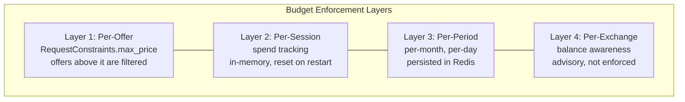

## Overview

The Broker applies three budget layers, analogous to how DSPs manage advertiser budgets in OpenRTB. The budget is a **filter over offers** at `BrokerService.Resolve`: the Broker drops every offer that would take the agent past its budget, and answers a URI left with no offer with `OFFER_ABSENCE_REASON_BUDGET_EXCEEDED`. The Exchange's balance check stays the authoritative gate on what is actually charged.

How a budget is computed — which price an offer counts at and how spend is counted — is the Broker's own behaviour, and the protocol does not specify it. This page describes one design. What the protocol does fix is how a budget's effect is reported, and that Resolve never charges:

- **Resolve never charges.** Returning an offer reserves nothing.
- **A budget is reported only as `OFFER_ABSENCE_REASON_BUDGET_EXCEEDED`**: never as `OFFER_ABSENCE_REASON_NOT_AUTHORIZED`, and never as a non-OK error such as `RESOURCE_EXHAUSTED`.

## Budget Layers



| Layer | Source of Truth | Enforcement | Crash Behavior | Storage |
|---|---|---|---|---|
| **Per-offer** | `RequestConstraints.max_price` | Drop an offer priced above it | Stateless -- always applied | None |
| **Per-session** | Broker in-memory map | Drop an offer that would take the session's spend past the session budget | Lost on crash; agent re-declares | In-memory |
| **Per-period** | Redis, keyed by `budget_scope`, else the verified agent identity | Drop an offer that would take the period's spend past `period_budget` | Survives restart (persisted in Redis) | Redis |
| **Per-Exchange** | Exchange's billing adapter | Advisory -- Exchange ultimately decides | Not Broker's state | External |

## Budget Scope Identifiers

`RequestConstraints` supports a `budget_scope` identifier so the agent can say "track this transaction against user X's monthly budget":

```go
type RequestConstraints struct {
    // ...existing fields...
    BudgetScope           string         // optional: "user:alice", "team:engineering", "project:q4-research"
    PreferredExchanges []string       // exchange domains with existing subscriptions/relationships
    PeriodBudget          *Cost          // per-period budget limit (proto: period_budget)
    BudgetPeriod          *time.Duration // budget period, e.g. 720h = 30 days (proto: budget_period)
}
```

Per-period budgets are keyed by `budget_scope` (or the verified agent identity if no scope is provided) and persisted in Redis with TTLs matching the period (e.g., monthly keys expire at month-end).

## Session Budget Tracker

```go
type BudgetTracker interface {
    // SetSessionBudget declares the budget for a session.
    SetSessionBudget(sessionID string, amount float64, currency string)

    // CanAfford reports whether buying an offer at this price would keep the
    // spend within the budget. It reserves nothing.
    CanAfford(amount float64, currency string) bool

    // Record adds a purchase's charged amount to the spend.
    Record(ctx context.Context, cost *forav1.Cost)

    // Remaining returns the remaining budget for the session.
    Remaining(sessionID string) (float64, string)
}

type inMemoryBudget struct {
    mu       sync.Mutex
    sessions map[string]*sessionBudget
}

type sessionBudget struct {
    limit    float64
    currency string
    spent    float64
    txnCount int
    lastTxn  time.Time
}

func (b *inMemoryBudget) CanAfford(amount float64, currency string) bool {
    b.mu.Lock()
    defer b.mu.Unlock()
    // A budget counts amounts in its own currency. This version of the protocol
    // defines no currency conversion.
    return (b.current.spent + amount) <= b.current.limit
}
```

## Batch Selection and Recording Spend

For batch (multi-URI) queries, the selection engine sums the prices of the offers it selects. If the total exceeds the remaining budget, it drops lower-priority URIs until the total fits (see the [Selection Engine](/components/broker/selection-engine/) batch pipeline). This is still filtering: nothing is reserved by `Resolve`.

In this design, spend is recorded when a purchase completes: for a purchase through the Broker, the Broker adds each entry of `BrokerTransactionResponse.totals` (one `Cost` per currency, covering only the charged items) to the budget of the same currency.

```go
func (b *inMemoryBudget) RecordPurchase(ctx context.Context, totals []*forav1.Cost) {
    b.mu.Lock()
    defer b.mu.Unlock()
    for _, t := range totals {
        if t.Currency != b.current.currency {
            continue // amounts are never converted between currencies
        }
        b.current.spent += t.Amount
    }
    b.current.txnCount++
    b.current.lastTxn = time.Now()
}
```

## Overspend Prevention

The Broker applies the budget while it selects offers, before it returns them. An offer the agent cannot afford is never returned, so the agent never holds it to buy.

### Budget Exhaustion Mid-Session

When the session or period budget leaves no affordable offer for a URI:

1. `Resolve` still returns OK. That URI's `OfferGroup` carries no offers and `absence_reason: OFFER_ABSENCE_REASON_BUDGET_EXCEEDED`; when no URI has an affordable offer, `DiscoveryResponse.absence_reason` is `OFFER_ABSENCE_REASON_BUDGET_EXCEEDED`.
2. It is not an error. The Broker never answers with `RESOURCE_EXHAUSTED` or `NOT_AUTHORIZED` for a budget.
3. The agent can re-declare a higher budget, or buy directly from an Exchange without the Broker.

```go
price := budgetPrice(offer.Pricing) // the Broker's own choice of price
if !budget.CanAfford(price, offer.Pricing.Currency) {
    // Drop the offer. If none remains for this URI, answer it with
    // OFFER_ABSENCE_REASON_BUDGET_EXCEEDED. Nothing is charged.
    continue
}
```

## Ephemeral vs. Persisted Budget State

Session budget state is ephemeral. If the Broker crashes, the agent re-declares its budget on reconnect. Per-period budgets (monthly, daily) are persisted in Redis and survive restarts.

This is a deliberate design choice: the Exchange's billing adapter is the authoritative source of truth for "can this requester afford this transaction," not the Broker.

## Currencies

Currency conversion is out of scope for this version of the protocol. A budget is stated in one currency (`period_budget.currency`), and only amounts in that currency count against it. Purchase totals are never summed across currencies: `BrokerTransactionResponse.totals` carries one entry per currency, and `TransactionResponse.total_cost` is unset when the purchased items span more than one currency.

## Budget Consistency at Scale

The Broker's budget is a filter over the offers it returns, not a reservation. The Exchange is the authoritative point for what is charged, and denies an item, in the body, if the requester's balance is insufficient. This means:

- If two Broker instances both return an offer the budget still allows, and the agent buys both, the spend can pass the budget by the price of the second purchase. Each purchase's totals are recorded when it completes, and later resolves filter against the new spend.
- The Exchange's balance check still bounds what the requester can be charged.
- The Broker's budget filter keeps the agent from buying what its budget does not allow; it is not a guarantee across concurrent purchases.

This model is deliberately simple. Distributed budget consensus (e.g., two-phase commit across Broker instances) adds latency and complexity without value, because the Exchange already provides the authoritative enforcement.

## Budget Reporting Metrics

```go
var (
    // Budget utilization per session
    budgetUtilization = promauto.NewHistogram(
        prometheus.HistogramOpts{
            Name:    "broker_budget_utilization_ratio",
            Help:    "Fraction of session budget spent (0.0 to 1.0+)",
            Buckets: []float64{0.0, 0.1, 0.25, 0.5, 0.75, 0.9, 1.0},
        },
    )

    // Budget exhaustion events
    budgetExhausted = promauto.NewCounter(
        prometheus.CounterOpts{
            Name: "broker_budget_exhausted_total",
            Help: "Number of URIs answered with BUDGET_EXCEEDED because the budget left no offer",
        },
    )
)
```
