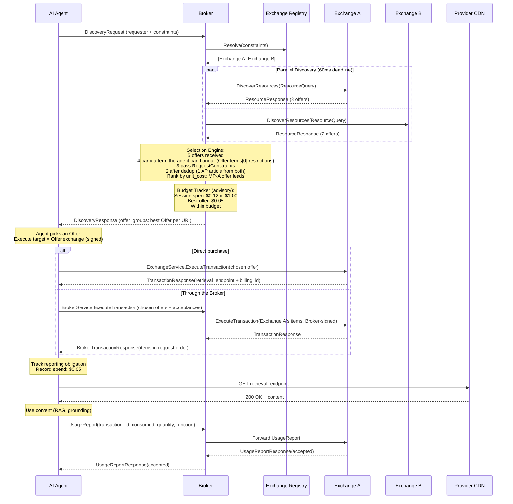

## What the Broker Does

The FORA Broker is the optional demand-side router in the FORA protocol. It sits with or near the AI agent, queries multiple Exchanges in parallel, compares offers, enforces budget, and selects the best deal. It is the "DSP" of metered resource access.

**The Broker is optional.** Agents can talk directly to Exchanges using the same `DiscoverResources`/`ExecuteTransaction`/`UsageReport` RPCs. The Broker adds value through:

- **Multi-exchange comparison** -- fan out DiscoverResources to N Exchanges, pick cheapest
- **Multi-exchange purchase** -- buy offers from several Exchanges in one `BrokerService.ExecuteTransaction` call, with the results combined in request order
- **Budget enforcement** -- per-request, per-session, per-Exchange cumulative tracking
- **Resource deduplication** -- same article from two Exchanges, compare price
- **Attestation-aware selection (v1.0)** -- prefer offers with higher attestation levels (Level 2 > Level 1 > Level 0)
- **Reporting relay** -- forward UsageReports to the correct Exchange, track `report_id` for dispute chain
- **Dispute relay (v1.0)** -- forward `DisputeRequest` messages to the correct Exchange
- **Selection transparency** -- logged rationale for every selection decision

The Exchange speaks the same protocol either way. On a purchase the Broker relays, the request is signed by the Broker, and the agent's consent arrives in the body as its acceptance signatures.

## Component Architecture

The Broker is composed of five internal components. Each is a Go interface with a concrete implementation. No inter-component communication uses the network; everything is in-process function calls.

```mermaid
graph TB
    subgraph "FORA Broker"
        MR[Exchange Registry]
        SD[Supply Discovery<br/>parallel fanout]
        SE[Selection Engine]
        BT[Budget Tracker]
        RR[Reporting Relay]
    end

    Agent[AI Agent] -->|DiscoveryRequest| SD
    SD -->|DiscoverResources| MPA[Exchange A]
    SD -->|DiscoverResources| MPB[Exchange B]
    SD -->|DiscoverResources| MPC[Exchange C]

    MR -.->|endpoint list| SD
    SD -->|[]ResourceResponse| SE
    BT -.->|budget check| SE
    SE -->|selected Offers| SD
    SD -->|DiscoveryResponse| Agent

    Agent -->|UsageReport| RR
    RR -->|forward| MPA
```

### Component Responsibilities

| Component | Responsibility | State |
|---|---|---|
| **Exchange Registry** | Knows which Exchanges exist and their health status. Bootstraps from [Exchange Manifest](/protocol/exchange-manifest/) (`/.well-known/fora.json`) instead of HEAD probes -- extracting endpoints, capabilities, and accepted verifiers in a single fetch | Long-lived, refreshed periodically |
| **Supply Discovery** | Fans out DiscoverResources RPCs to N Exchanges concurrently | Per-request, stateless |
| **Selection Engine** | Deduplicates, ranks, filters, and selects the best offer | Per-request, stateless |
| **Budget Tracker** | Tracks cumulative spend per session/period and enforces limits | Per-session in-memory, per-period in Redis |
| **Reporting Relay** | Forwards UsageReports to the winning Exchange, tracks obligations | Per-transaction, short-lived |

## Internal Call Flow

`Resolve` is **discovery-only**. It gathers offers across Exchanges, selects the best per URI, and returns them as a `DiscoveryResponse` (one `OfferGroup` per requested URI). It does **not** execute or deliver — committing to an offer is a separate call: `ExchangeService.ExecuteTransaction` at the offer's Exchange, or `BrokerService.ExecuteTransaction` at the Broker (see [Execution](#execution-separate-step) below).

```go
func (o *Broker) Resolve(ctx context.Context, req *forav1.DiscoveryRequest) (*forav1.DiscoveryResponse, error) {
    // 1. Resolve which Exchanges to query
    exchanges := o.registry.Resolve(req.Constraints)

    // 2. Fan out DiscoverResources to all Exchanges (multi-URI: all URIs in one query per MP)
    responses := o.discovery.FanOut(ctx, exchanges, req)

    // 3. Build one OfferGroup per requested URI: dedup, rank, and budget-filter
    //    the gathered offers for that URI. A URI with no viable offer is not an
    //    error — its group carries absence_reason and an empty offers list
    //    (mirrors OfferGroup from DiscoverResources). Non-OK errors are reserved
    //    for malformed requests, auth failures, and internal faults.
    groups := make([]*forav1.OfferGroup, 0, len(req.Uris))
    for _, uri := range req.Uris {
        selection, err := o.selector.SelectForURI(ctx, uri, responses, req.Constraints, o.budget)
        if err != nil {
            groups = append(groups, &forav1.OfferGroup{
                Uri:            uri,
                AbsenceReason:  o.absenceReason(err).Enum(),
            })
            continue
        }
        groups = append(groups, &forav1.OfferGroup{
            Uri:    uri,
            Offers: selection.Offers, // full signed Offers, forwarded unchanged
        })
    }

    // 4. Return the offers to the agent. The agent (or the Broker, on the agent's
    //    behalf) commits separately via ExecuteTransaction — see below.
    return &forav1.DiscoveryResponse{
        OfferGroups: groups,
    }, nil
}
```

### Execution (separate step)

After the agent picks offers from the `DiscoveryResponse`, committing to them is a distinct exchange on the execute path. The execute target of each offer is `Offer.exchange` — the canonical Exchange domain carried inside the signed Offer bytes, so a relaying Broker cannot redirect execution without invalidating the signature. The agent buys either way:

- **Directly** — one `ExchangeService.ExecuteTransaction` per Exchange, signed by the agent.
- **Through the Broker** — one `BrokerService.ExecuteTransaction` call for offers from any number of Exchanges. The request is the same `TransactionRequest`, and it returns a `BrokerTransactionResponse`.

### BrokerService.ExecuteTransaction: re-packaging

The Broker re-packages the agent's purchase. What holds the set together is `TransactionRequest.agent_request_acceptance` — a detached Ed25519 signature by the **agent** over the complete ordered list of `(offer signature, exchange)` references plus the requester and the idempotency key — and each item's `agent_acceptance`.

1. The agent signs one `AgentAcceptance` per offer and one `AgentRequestAcceptance` over every selected offer, in order, across all Exchanges, and sends the request to the Broker, RFC 9421-signed for the Broker's URL. The request terminates at the Broker.
2. The Broker verifies the agent's signature and checks that `requester.domain` is the agent's verified signing directory (the host of the WBA directory the covered `Signature-Agent` header names). It checks that every item's Exchange is one it can route to and approves for purchases. It refuses anything else before it sends a single sub-request.
3. It groups the items by `offer.exchange` and sends one `ExchangeService.ExecuteTransaction` to each Exchange. Each sub-request is a new HTTP request the Broker authors and signs with **its own** key. It carries only the items addressed to that Exchange, in request order, with their acceptances, plus the **unchanged** `AgentRequestAcceptance`, `requester` and idempotency key. See [Projected execute requests](/protocol/authentication/#projected-execute-requests) for who signs what and how the Exchange resolves the acceptance verification key.
4. Each Exchange verifies the acceptance signatures and requires its sub-request to equal the complete in-order projection of the signed set addressed to itself — so the Broker cannot drop, reorder, append, or split the items for that Exchange without being refused.
5. The Broker combines the answers into one `BrokerTransactionResponse`: one result per request item in request order, one `ExchangeOutcome` per Exchange contacted, and charged totals per currency.

**Why re-packaging is safe.** Each item is atomic and its integrity is per resource. Each offer carries its own Exchange's signature, each acceptance binds the agent to that one offer, and each item's result comes from the Exchange that owns the resource. The Broker therefore assembles independent per-resource purchases. It cannot alter any of them without breaking that item's Exchange signature or the agent's acceptance, and no cross-item integrity is needed. In a result item, the one signed value is the `retrieval_endpoint`, signed by the issuing Exchange; the other fields are the Broker's unsigned report of what each Exchange answered.

**Upstream refusals ride in the body.** An Exchange that refuses the Broker's whole sub-request, or does not answer it, never becomes an error of the Broker's own. Each affected item carries `TransactionResultItem.refusal` — the Exchange, the Connect code it answered with, and its `ErrorDetail` unchanged — and the other Exchanges' results come back unchanged. `DENIAL_REASON_CONTENT_UNAVAILABLE` is never used as a catch-all for an upstream failure. An item whose provider does not accept relayed purchases is denied with `DENIAL_REASON_RELAY_NOT_ACCEPTED`, and the agent buys that offer directly.

**The Broker's own refusals** are non-OK errors with an `ErrorDetail`: `unauthenticated` with `request_auth_failure` for a bad agent signature, and `SIGNATURE_INVALID` for a `requester.domain` that is not the signing directory; `invalid_argument` for a malformed request; `failed_precondition` for an Exchange it cannot route to or does not approve.

**Idempotency.** The Broker forwards the agent's `idempotency_key` unchanged to every Exchange; it cannot change it, because the acceptances sign it. A retry through the Broker therefore reaches each Exchange as a replay and is answered from that Exchange's stored result.

**Delegation.** The Broker is the wire signer of every sub-request, so each Exchange checks a delegation's `cnf.jkt` against the key the item's `AgentAcceptance` verifies under, not against the Broker. The agent does not need to delegate to the Broker.

A single-Exchange purchase is the degenerate case: the projection is the whole set, and the SDK clients attach the acceptance there too.

## Request Signing and the Forwarding Signature Stack

FORA uses a two-layer signing model for a request forwarded byte-for-byte: the **agent's request signature** proves who originated the request, and the **forwarding signature stack** proves which intermediaries forwarded it. A purchase through `BrokerService.ExecuteTransaction` is re-packaged instead (see above): each sub-request carries only the Broker's signature, and the agent's consent rides in the body.

### Request Authentication

The `Requester` message carries identity and entitlements only (`id`, `domain`, `type`, `scopes`, optional `delegation`) — it has **no** signature field. The request is authenticated by an RFC 9421 HTTP Message Signature (alg=ed25519) computed over the whole HTTP request and carried in the headers. The Exchange verifies it against the public key published in the signer's WBA directory at `{domain}/.well-known/http-message-signatures-directory`, with the domain resolved from the covered `Signature-Agent` header.

The Broker passes `Requester` through unchanged -- it never modifies the requester's identity, scopes, or delegation -- and adds its own forwarding signature in the headers (see below).

### Forwarding Signature Stack (RFC 9421)

Multi-hop forwarding is carried entirely in the HTTP headers, not in the message body. Each forwarding party adds one labeled RFC 9421 HTTP Message Signature covering the request **and the prior hop's signature**. The ordered set of these labeled signatures *is* the forwarding chain -- there is no `intermediaries` field on `ResourceQuery`.

Each labeled signature, via its RFC 9421 signature parameters, effectively records:

- **`keyid`** -- the intermediary's RFC 7638 thumbprint, resolved against its canonical domain (for public key lookup)
- **`created`** -- timestamp of when the intermediary forwarded the request
- the covered components -- the request plus the preceding hop's `Signature` value, chaining the hops together

When the agent queries an Exchange directly, there are no forwarding signatures. When the request passes through a Broker, the Broker adds one labeled signature to the stack.

```go
// Broker adds one labeled RFC 9421 signature to the outgoing request headers when forwarding.
func (o *Broker) signHop(req *http.Request, priorSig string) {
    // Covers the request line/headers AND the prior hop's Signature value,
    // chaining this hop to the one before it.
    label := o.domain // e.g., "broker.example.com"
    sigInput, sig := o.rfc9421Sign(req, priorSig, label) // Ed25519, keyid=o.thumbprint, created=now
    req.Header.Add("Signature-Input", sigInput)
    req.Header.Add("Signature", sig)
}
```

### Exchange Verification

The Exchange verifies both layers:

1. **Requester signature** -- verified against the public key in the agent's WBA directory at `{domain}/.well-known/http-message-signatures-directory` (domain from the covered `Signature-Agent` header, key selected by the `keyid` thumbprint)
2. **The forwarding signature stack** -- each labeled RFC 9421 signature is verified against the key its `keyid` thumbprint selects from the key set the Exchange is configured with (`Signature-Agent` stays the agent's directory, so a Broker's key is not discovered through it), and the chained coverage is checked hop-by-hop.

All signatures must pass. The Exchange counts the number of forwarding hops in the stack against `max_hops` / `max_intermediary_hops` and rejects requests that exceed the limit.

The Broker publishes its keys in its WBA directory (the JWK Set at `{domain}/.well-known/http-message-signatures-directory`) — RFC 7517 Ed25519 JWKs, each identified by its RFC 7638 thumbprint (the RFC 9421 `keyid`). Its `fora.json` manifest uses the same format as agents (`role=ROLE_AGENT`). An Exchange verifies the Broker's signatures against keys it has loaded from that directory into its configured key set. The covered `Signature-Agent` header stays the agent's directory and does not point at the Broker's, so the Exchange must know the Broker — for example, through registration — before it can verify the hop.

## Profile-Based Routing

The Broker uses domain profiles to route queries to the right Exchanges.

### How It Works

1. **Agent declares profiles** -- `DiscoveryRequest.supported_profiles` lists which domain extension profiles the agent understands (e.g., `["fora-academic-v1"]`)
2. **Broker filters Exchanges** -- the Exchange Registry checks each Exchange's `WellKnownManifest.supported_profiles` and routes queries only to Exchanges that support at least one of the requested profiles
3. **Broker forwards profiles** -- the declared profiles are forwarded in `ResourceQuery.supported_profiles`, so the Exchange knows which profile-specific `ext` fields to include in offers
4. **Exchange responds with profile data** -- the Exchange includes profile-specific metadata (e.g., retraction status, citation counts for academic content) only when the caller declares support

### Example: Academic Research Agent

An agent working on a literature review sends:

```json
{
  "supported_profiles": ["fora-academic-v1"]
}
```

The Broker's Exchange Registry contains three Exchanges:
- **academic-mp.example.com** -- `supported_profiles: ["fora-academic-v1", "fora-legal-v1"]`
- **news-mp.example.com** -- `supported_profiles: ["fora-news-v1"]`
- **general-mp.example.com** -- `supported_profiles: []` (no profiles)

The Broker queries only **academic-mp.example.com** (profile match) and **general-mp.example.com** (no profile restriction -- always included). It skips **news-mp.example.com** (no matching profile).

## Scope Forwarding, Token Narrowing, and Quota Aggregation

### Scope Forwarding

The Broker forwards `Requester.scopes` to every Exchange it queries. Scopes control what the requester can access -- the Exchange filters its catalog to resources matching these scopes. The Broker does not modify scopes; it passes them through as-is.

### Delegation Narrowing (only when the Broker is a delegated holder)

By **default the Broker is a pure relay**: it passes `Requester.delegation` through unchanged and the **agent remains the holder**. On a forwarded request the agent's RFC 9421 request signature is what the Exchange matches against the delegation's `cnf` (the Broker's hop signature is provenance only); on a re-packaged purchase the Exchange matches the key the item's `AgentAcceptance` verifies under. A relay cannot narrow a delegation it does not hold: only a key named in the chain's `cnf` can issue a valid child JWT.

Narrowing is therefore possible **only when the agent has explicitly delegated to the Broker's key** (the Broker is the terminal holder in the chain). In that case the Broker issues a child JWT — `scope ⊆ parent`, bound (`cnf.jkt`) to the Broker's key — and **signs the request itself**, so the binding now matches the Broker's signature:

- Original delegation (agent → Broker): `scope: academic:*, max_spend_cents: 50000`
- Narrowed for Exchange A: `scope: academic:read, max_spend_cents: 10000`

The child JWT is signed by the key its parent named in `cnf` (`scope ⊆ parent`); the Exchange verifies the full JWT chain back to the original principal. This is an opt-in delegation step, not the default forwarding behavior.

### SubscriptionQuotaInfo Aggregation

When multiple Exchanges return `SubscriptionQuotaInfo` on their offers or transaction responses, the Broker MAY aggregate this quota information before returning it to the agent. This gives the agent a consolidated view of remaining quota across Exchanges, enabling proactive throttling without the agent needing to track per-Exchange quota independently.

## Three Discovery Modes

Agents can discover content through the Broker in three ways, depending on how much they know about what they need. All three modes feed into the same Selection Engine -- the Broker compares offers identically regardless of how they were discovered.

### 1. Specific URIs

The agent already knows which resources it wants. It sends `DiscoveryRequest.uris` with one or more specific content identifiers (DOIs, URLs, etc.). The Broker forwards these as a `ResourceQuery` to each Exchange and collects offers.

```json
{
  "uris": ["doi:10.1038/s41586-024-07386-0", "doi:10.1126/science.adq3854"]
}
```

This is the simplest mode -- the agent has exact references and wants the best price across Exchanges.

### 2. Structured Search

The agent knows what kind of content it needs but not the exact URIs. It sends `DiscoveryRequest.search_filters` with profile-specific key-value pairs. The Broker maps these to Exchange-specific query parameters and discovers matching resources.

```json
{
  "search_filters": {
    "academic.topic": "CRISPR gene therapy",
    "academic.year_min": 2023,
    "academic.peer_reviewed": true
  }
}
```

Filter keys are profile-specific: `academic.topic`, `news.category`, `legal.jurisdiction`, `medical.specialty`, etc. The Broker translates these into the native query format of each Exchange it contacts.

### 3. Natural Language

The agent describes what it needs in free text. It sends `DiscoveryRequest.query` with a natural-language description. The Broker interprets the query and searches across Exchanges on the agent's behalf.

```json
{
  "query": "Recent peer-reviewed studies on mRNA vaccine efficacy in immunocompromised patients"
}
```

This mode is useful for exploratory research where the agent cannot formulate structured filters. The Broker resolves the intent into Exchange queries.

### Combining Modes

All three modes can be combined in a single request. For example, an agent can send specific URIs it already knows about, plus a search query to discover additional relevant resources:

```json
{
  "uris": ["doi:10.1038/s41586-024-07386-0"],
  "query": "Related studies on CRISPR delivery mechanisms",
  "search_filters": {
    "academic.year_min": 2022
  }
}
```

The Broker merges results from all modes, deduplicates across them, and feeds everything into the Selection Engine for comparison and ranking.

## Discovery Extension Point (v2)

The Broker's internal `SupplySource` interface is the extension point for content discovery beyond Exchange queries. In v1, all URIs come from the agent's request. In v2, the Broker can discover URIs on the agent's behalf:

```go
// SupplySource abstracts where content offers come from.
// v1: only ExchangeSource (queries an Exchange).
// v2: SearchSource (Exa, Tavily), RecommendationSource, etc.
type SupplySource interface {
    // Query returns offers from this source matching the request.
    Query(ctx context.Context, req *forav1.ResourceQuery) (*forav1.ResourceResponse, error)

    // Domain returns the source identifier (exchange domain or service name).
    Domain() string

    // Kind returns the source type for selection policy routing.
    Kind() SupplySourceKind // Exchange, SearchEngine, Archive, etc.
}
```

The flow: search/recommendation produces URIs, the Broker looks up an Exchange for each URI's domain (via fora.json), the Exchange provides pricing/offers, and the standard transaction flow continues. Discovery is upstream of transactions -- it produces URIs, not offers. The `OfferGroup.discovery_method` field tells the agent how each URI was found.

This positions the Broker as the natural integration point for agentic search -- agents that need content don't just request known URLs, they ask "find me articles about X" and the Broker discovers and prices the matching offers, returning them for the agent to commit to via a separate `ExecuteTransaction` call.

## Request Lifecycle (End-to-End)

Full request lifecycle from agent to content delivery:



## Key Design Decisions

| Decision | Rationale |
|---|---|
| **Broker is optional** | Agents can query Exchanges directly. The Broker adds multi-exchange intelligence but is not required by the protocol. |
| **Same protocol, re-packaged purchases** | The Exchange answers the same RPCs whoever calls. A purchase the Broker relays is signed by the Broker, and the Exchange verifies the agent's consent from the body acceptances. |
| **Signed offer pass-through** | Exchange signatures cover pricing fields. The Broker cannot inflate prices without invalidating the signature. |
| **Advisory budget enforcement** | The Broker pre-filters transactions by budget, but the Exchange is the authoritative enforcement point. No overspend occurs because the Exchange is the gatekeeper. |
| **Ed25519 + forwarding signature stack** | Requester signs the HTTP request with an RFC 9421 HTTP Message Signature (covering `@method`/`@target-uri`/`content-digest`); Broker adds one labeled RFC 9421 HTTP Message Signature (covering the request plus the prior hop's signature) to the header stack. Exchange verifies both layers and counts hops against `max_hops` / `max_intermediary_hops`. Public keys discoverable via the WBA directory (the JWK Set at `/.well-known/http-message-signatures-directory`). |
| **Partial results are normal** | If 3 of 5 Exchanges respond within the deadline, the Broker proceeds with 3 responses. Availability of any individual Exchange does not block the system. |

## Go Module Structure

```
github.com/FORA-Protocol/protocol/broker/
    cmd/
        broker/           # Sidecar binary entrypoint
            main.go
    pkg/
        broker/           # Core broker logic (used by all deployment modes)
            broker.go     # Broker struct + Resolve
            config.go           # Configuration loading
        registry/               # Exchange Registry
            registry.go         # ExchangeRegistry interface + in-memory impl
            crawler.go          # fora.json crawler
            health.go           # Health checker
        discovery/              # Supply Discovery (parallel fanout)
            fanout.go           # FanOut implementation
            clientpool.go       # Connect client pool management
        selection/              # Selection Engine
            engine.go           # SelectionEngine interface + default impl
            pipeline.go         # Filter, dedup, rank stages
            policy.go           # Pluggable selection policies
        budget/                 # Budget Tracker
            tracker.go          # BudgetTracker interface + in-memory impl
        reporting/              # Reporting Relay
            relay.go            # ReportingRelay interface + impl
            obligations.go      # Obligation tracking + deadline checker
        metrics/                # Prometheus metrics
            metrics.go          # All metric definitions
    internal/
        testutil/               # Test helpers
```
