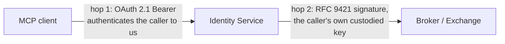

import { Aside } from '@astrojs/starlight/components';

## What it is

The Identity Service is a single Go binary that does two jobs: it is the **custodian of every agent's private key**, and it is the **MCP endpoint an agent connects to** in order to use FORA.

It exists because FORA identifies a participant by an Ed25519 key it controls. Possession is proven per request with an [RFC 9421](https://www.rfc-editor.org/rfc/rfc9421) HTTP Message Signature, and the key is resolved from a directory published on a domain the participant owns. An agent running inside a chat client has none of that: no key store, no domain, no way to publish a well-known document. The Identity Service supplies all three and signs on the agent's behalf.

The binary is two layers, and the split is deliberate:

- A **Web Bot Auth identity core** that knows nothing about FORA. It generates and custodies keys, mints a subdomain per agent, publishes the standards-shaped documents a generic verifier reads, and signs outbound requests.
- A **thin FORA adapter** on top: an MCP endpoint exposing five tools, each turning a tool call into a key-signed FORA request to a Broker or an Exchange.

The core is independently useful — it provisions Web Bot Auth identity for any agent — and FORA is its first consumer.

<Aside type="note" title="This page describes shipped code">
Implementation baseline: the reference implementation at `cbf2d3a0` (2026-10-01). This service replaced an earlier Python proxy that held one shared key and took an API key per caller; nothing of that design survives.
</Aside>

## Why an agent needs this at all

FORA's authentication is holder-of-key. A verifier resolves the signer's public key from a directory at the signer's own origin, named in a covered `Signature-Agent` header. It then matches the signature's `keyid` against the [RFC 7638](https://www.rfc-editor.org/rfc/rfc7638) thumbprint of a key in that directory. Nothing about that is FORA-specific — it is the Web Bot Auth shape, so a FORA-provisioned agent is verifiable by any Web Bot Auth origin, not only by an Exchange.

An agent that holds its own key and publishes its own directory needs none of this service. It is the same participant on the wire and speaks the same protocol. The Identity Service is for the agents that cannot, which today is most of them.

## What an agent gets on sign-up

Signing in provisions a full protocol participant, not only a login:

1. **A subdomain of its own** — `agent-<slug>` under the registry's wildcard domain, where the slug is eight lowercase base32 characters from `crypto/rand`, about 40 bits of entropy. It is DNS-valid, unpredictable, and leaks no identity.
2. **An Ed25519 keypair**, generated server-side, private half written to Vault.
3. **Four published documents** at that subdomain, listed below.

The account row is the authoritative record of registration, and sign-up reserves it **before** minting the key and writing the card. No transaction spans Postgres, Vault and the document store, so the sequence is designed to be replayed after a crash between the steps. An agent part-way through onboarding therefore serves its role marker while its key directory still answers 404 — the documents are not a sound test of registration in either direction.

### The published documents

| Path | What it is | Media type |
|---|---|---|
| `/.well-known/http-message-signatures-directory` | Web Bot Auth key directory — an RFC 7517 JWK Set | `application/jwk-set+json` |
| `/.well-known/signature-agent-card.json` | Signature Agent Card, the agent's self-description | `application/json` |
| `/.well-known/fora-key-revocations.json` | Key revocation list | `application/json` |
| `/.well-known/fora.json` | FORA role marker | `application/json` |

Two properties of the directory are load-bearing. It is assembled as a real JWK Set with a JOSE library rather than marshalled from FORA's protobuf. The audience is any Web Bot Auth verifier on the open internet, and those implement RFC 7517, not `fora.v1`. And keys come out **newest-first**, which matters for the signing tie-break described below.

Keys carry no `kid`. Identity is the RFC 7638 thumbprint, so entries are deduplicated on the JWK `x` member actually emitted into the document. The FORA-specific `not_before` / `not_after` validity window is spliced onto each key as an extension member, which a generic verifier ignores.

A key is active when the present instant falls inside the **half-open** window `[not_before, not_after)`. During a rotation overlap more than one key is active. Which key is used then depends on the operation:

- **Signing.** The service signs with the first active key in document order, so the newest key is used. This is an SDK tie-break, not a protocol rule.
- **HTTP signature verification.** The verifier uses the key whose RFC 7638 thumbprint matches the signature's `keyid`, if that key is active and not revoked. Document order plays no part. A signature made with the older key stays valid until that key's window closes.
- **Detached acceptance verification.** A detached acceptance carries no `keyid`, so the verifier tries every Ed25519 key that is currently valid in the requester's directory.

The agent's `fora.json` is a role marker and nothing more: `ver`, `role: ROLE_AGENT`, `domain`. The publisher-only fields do not apply to an agent, and **no identity key appears in it** — keys live in the Web Bot Auth directory. A verifier resolves that directory from the covered `Signature-Agent` header, so the overlay is never an input to authentication.

## Two-hop authentication

This is the invariant the whole service rests on, and the two hops are never bridged.

1. **Inbound.** The MCP endpoint authenticates the caller with an OAuth 2.1 Bearer token it issued. An unauthenticated request is refused before any outbound call is made.
2. **Outbound.** The FORA request is signed with **that caller's own per-user key**. One developer, one subdomain, one key, so every MCP user is a distinct FORA agent to the Broker and the Exchange.

The bearer authenticates the caller to the service; the signature authenticates that agent to its peers. Neither is derived from the other.

Which agent is being signed for comes from the **authenticated identity on the request context**, never from a field the caller filled in. That is the security question in this component. Read the subdomain off the wire instead, and the service will sign as whoever it is asked for — impersonation with the registry's own key custody behind it. A request carrying no identity is refused rather than signed as anyone.

The signing key is resolved per request and never cached. An agent's active key changes under rotation and disappears under revocation, and a cached key would keep signing with a retired one.

## Sign-in

The service runs its own OAuth 2.1 authorization server and federates authentication upstream to an OIDC provider. The reference deployment runs a stock Zitadel for that — no custom protocol mappers, no custom claim providers, no plugins — so another OIDC provider takes the same slot.

| Path | Purpose |
|---|---|
| `/.well-known/oauth-protected-resource` | RFC 9728 metadata, named in the `WWW-Authenticate` challenge |
| `/.well-known/oauth-authorization-server` | RFC 8414 metadata an MCP client reads to find the rest |
| `/register` | Dynamic Client Registration |
| `/authorize` | Authorization request |
| `/callback` | Upstream OIDC return; provisions the identity |
| `/consent` | Developer approves the requesting client; releases the code |
| `/token` | Code exchange |

An MCP client needs no pre-arranged credentials: it discovers the endpoint's metadata from the `401`, registers itself dynamically, and drives the flow. Authorization codes are PKCE-protected with `S256`, authorization responses carry the RFC 9207 `iss` parameter, and the only grant type offered is `authorization_code`. Codes live five minutes and access tokens an hour.

Nothing in the sign-in path mints keys itself. It composes the sign-up service, the OAuth store, the session codec, the upstream authenticator and the token issuer.

## The five tools

Each tool is one protocol verb. What differs between them is where the call goes, and that is not uniform — two traverse the Broker and three go straight to an Exchange.

| Tool | Destination | Transport |
|---|---|---|
| `fora_register` | `ExchangeService.Register` | direct to the named Exchange |
| `fora_status` | `ExchangeService.GetAccountStatus` | direct to the named Exchange |
| `fora_discover` | `BrokerService.Resolve` | via the Broker |
| `fora_execute` | the Broker's execute relay | via the Broker |
| `fora_report` | `ExchangeService.ReportUsage` | direct to the offer's own Exchange |

Registration must reach the Exchange directly, because the Exchange derives the binding between an account and an identity from the agent's **own** inbound signature. The Broker relay re-signs the transport hop with the Broker's key and carries agent identity in a detached body acceptance — right for fan-out purchases, and it would defeat registration's identity model.

`fora_report` takes no endpoint argument. The destination is read off the report's own exchange field, which the offer signed, and resolved from that Exchange's manifest. There is no parameter a misconfigured origin could arrive through.

A few input details worth knowing:

- `fora_discover` accepts `uris`, a free-form `query`, and `search_filters`, and needs at least one of the three. An empty filter object counts as absent. Offers are verified before the agent sees them, because an agent on this surface runs no verifier of its own.
- `fora_execute` takes the offers unchanged, an `idempotency_key`, and `embed_content` (see below). A single offer is a batch of one.
- `fora_register` takes the target Exchange and a `fields` object whose shape that Exchange publishes in its own `fora.json`. Submitting a registration accepts that Exchange's terms at the revision its digest names, and the call echoes the digest so the acceptance records which revision was agreed.

## MCP transport

The endpoint is `/mcp` and speaks MCP over Streamable HTTP. It is stateless: every request is served on its own, and no MCP session state is kept between requests.

- **Protocol versions.** The endpoint accepts `2026-07-28`, `2025-11-25`, `2025-06-18`, `2025-03-26` and `2024-11-05`. A `2026-07-28` client starts with `server/discover` and sends no handshake. A client on an older version may send `initialize` first, but the endpoint does not require it. A request whose `Mcp-Protocol-Version` header names any other version is refused with `400`.
- **No session.** The endpoint issues no `Mcp-Session-Id` and does not need one.
- **POST only.** An authenticated `GET` or `DELETE` returns `405` with `Allow: POST`, so there is no server-to-client event stream and no session to delete. A JSON-RPC request is answered with one `application/json` body. A notification is accepted with an empty `202`.
- **Load balancing.** Any instance can serve any request, so a load balancer needs no session affinity.
- **Headers on `2026-07-28`.** Each request carries its method in the `Mcp-Method` header and, on a tool call, the tool name in `Mcp-Name`. It also carries its protocol version in the request's `_meta`. A request where any of these is missing, or does not match the body, is refused with `400`.

## Why the service fetches the content

Two decisions collided here, and the resolution is worth understanding before deploying this.

A signed delivery URL is bound to the thumbprint of the key that signed the offer acceptance, and a capable edge refuses any fetcher that cannot prove possession of that key. That is what makes a stolen URL worthless. But under custody the *registry* signs the acceptance, so the URL is bound to the registry's key — and the agent, which holds no key, can never produce the proof. Composed naively, every URL issued through this flow could only be used by the service itself, and every agent fetch got a 403.

The resolution: **the service fetches the licensed bytes itself**, presenting the custodied key as the proof of possession, and returns the content to the agent inside the tool result. The constraint was never that nobody could produce the proof, only that the *agent* could not. Moving the fetch to where the key already lives makes the proof producible by construction, with no change to the protocol, the Exchange, the edge's contract, or any agent client.

The fetch is eager, inside `fora_execute`, so nothing has to be stored between calls and the edge records exactly one delivery per purchase. `embed_content: false` skips it: the purchase still happens and the result carries each item's `retrieval_endpoint` and transaction id, but no content. That option has two limits, and the tool states both to the agent. The URL is a bearer credential until it expires, about five minutes later. And it works alone only where the edge does not enforce the key binding.

<Aside type="caution" title="What custody costs">
The service transits content it does not license. That is bandwidth, latency, and a blast radius: a compromised registry could already impersonate every agent in its custody, and it can also read their content in flight. The agent additionally loses its own network path and cache. This does not widen *who* is trusted — the custody model already concentrates that — only *what* passes through them. An agent that holds its own key avoids the question entirely.
</Aside>

## Key custody

Private keys live behind a `KeyStore` interface whose shipped backend is HashiCorp Vault (KV v2), which owns encryption at rest, access control and the audit log. Whoever can read that store can impersonate every agent in it, which makes it the most security-sensitive component in the service.

The interface hands back a `crypto.Signer` rather than the private key, so a stronger backend — Vault Transit, a KMS, an HSM — is a drop-in that signs without ever surrendering key bytes. The RFC 9421 signing libraries currently need raw Ed25519 bytes, so the signing path narrows the signer back and fails explicitly when a backend will not hand them over. That failure is an honest report of a real gap: moving custody to an HSM means teaching the signing path to drive a `crypto.Signer`, not swapping an adapter.

Keys are addressed by `{subdomain, thumbprint}` together. The agent's durable identity is its subdomain; the thumbprint selects which of that agent's keys is meant. An account keyed on the thumbprint alone would be orphaned by the agent's first rotation.

Both halves of that pair are public — they are what the directory publishes — so knowing them entitles nobody to anything. There is no public endpoint that returns key material. At the implementation baseline the operator CLI offers only `revoke`; it has no export command. An export alone would not give self-custody anyway, because the custody store would still hold a copy of the key. To move an agent to self-custody, rotate it to a key the service never held.

## Rotation and revocation

Because an account is linked to the agent's subdomain rather than to a single key, changing keys never breaks the account.

**Rotation** is a scheduled background loop. It mints a replacement, publishes it alongside the old key, and holds both valid through an overlap window carried by each key's `not_before` / `not_after`. New signatures use the new key; in-flight requests and cached directory copies keep verifying against the old one until its window closes, after which it is pruned.

**Revocation** is the operator's emergency lever. It publishes the compromised key to the subdomain's revocation list and destroys the material.

<Aside type="danger" title="Removing a key is not revoking it">
A consumer that meets an unknown thumbprint treats it as *unknown*, not as *revoked*. Dropping a key from the directory therefore revokes nothing. Emergency revocation must publish to the revocation list.
</Aside>

Rotation runs inside the server process, so it clears the cached documents and the new key shows up in the served directory at once. Revocation through the operator CLI is different. At the implementation baseline, the CLI runs as a separate process and cannot clear the running server's cache. The service can keep serving the old directory and revocation list for up to 300 seconds, the default cache TTL.

That is only the publication delay. Each verifier sees the change when it next fetches the directory or revocation list, and that depends on its own cache. The total time until every verifier rejects a revoked key can therefore be longer, and no single bound applies.

## Deployment shape

| Dependency | Required | Why |
|---|---|---|
| PostgreSQL | yes, at start-up | Its own database, separate from the Exchange's: agent cards, revocations, developer accounts, OAuth records |
| HashiCorp Vault | yes | The only place agent private keys are stored |
| An OIDC provider | yes, at start-up | Where developers actually sign in |
| A Broker address | yes, at start-up | Only the address; the Broker need not be answering yet |
| Outbound HTTPS, unrestricted | yes, at runtime | Delivery addresses are not known in advance, so no fixed allow-list is possible |
| Wildcard DNS and matching wildcard TLS | yes, at runtime | Every agent gets its own subdomain, and other parties fetch its key from there |

The service listens on **one port, `:8083`**. There is no admin port and no second listener.

Three things operators look for and will not find:

- **No command-line flags.** Configuration is entirely environment variables. The binary takes one argument, `healthcheck`, which probes its own `/healthz` — so a container health check can run the binary itself, in an image with no shell to probe with.
- **No `/metrics` endpoint** and no Prometheus support. Alerting is done on log events.
- **No switch that turns the MCP endpoint off.**

Durations are Go-format (`30s`, `5m`, `2160h`) and **days are not a unit** — `90d` does not parse, and a duration that does not parse is silently replaced by its default.

## Next steps

- [Authentication](/protocol/authentication/) — the signature rules, the key directory, and scope matching
- [Live Demo: First License](/getting-started/poc-walkthrough/) — sign up through this service and watch the identity provision
- [For AI Agents](/getting-started/for-ai-agents/) — the client-side path for an agent that holds its own key
- [Role Composition](/protocol/role-composition/) — how per-role key separation holds when one operator runs several roles
