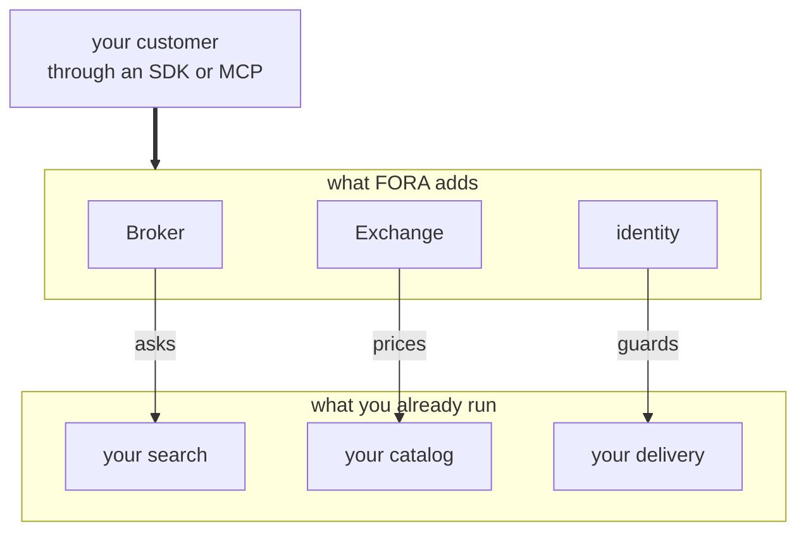
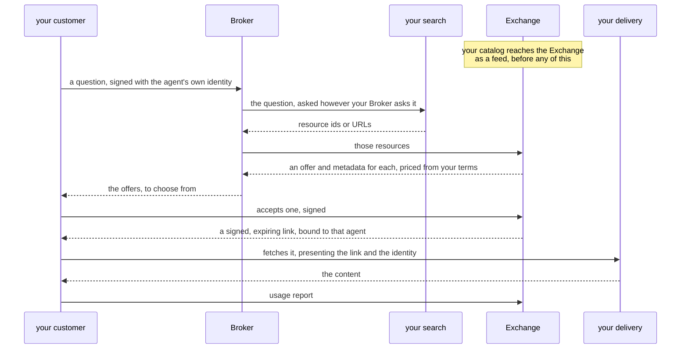

import { Aside } from '@astrojs/starlight/components';
import { PACKAGES } from '../../../consts';

## What FORA gives you

Interoperability. Your customers reach your catalog through an interface they already have a client for, and you keep running the marketplace you built.

Everything you have maps onto something FORA already defines. This page is that mapping.

Three new parts, each sitting over one you already have. The Broker asks your search. The Exchange prices your catalog. Identity guards your delivery. Your customer talks only to the FORA side, which is why their existing client works without knowing anything about how you built the rest.

| What you run | What FORA calls it | What changes |
|---|---|---|
| Your catalog | the catalog an Exchange holds | You publish it as a feed. The content never moves. |
| Your search, index or recommender | the Broker's discovery | You implement the Broker's discovery with it. See below — this is the interesting one. |
| Your prices and licensing terms | offers and license terms | Expressed so software reads them, per resource, instead of in a contract someone reads. |
| Your API keys and accounts | identity, and a signed link per purchase | Each customer is a verifiable identity. Each purchase gets its own expiring link. |
| Your usage logs and invoicing | transaction and usage records | One record per purchase, one per delivery, reconcilable against your own logs. |
| Your client libraries and docs | <a href={PACKAGES.go.url}>Go</a>, <a href={PACKAGES.ts.url}>TypeScript</a> and <a href={PACKAGES.python.url}>Python</a> SDKs, and an MCP endpoint | Already written, already installed by your customers. |

## Your search stays your search

This is the part people expect to lose, and it is the part FORA is built to keep.

FORA splits discovery from pricing. A **Broker** takes a customer's question and turns it into a list of resources. An **Exchange** answers with an offer and metadata for each one, so the customer can judge what is relevant. The Exchange never searches. It responds for resources it already holds.

How a Broker gets from a question to a list is entirely its own business. So you take FORA, implement the Broker's discovery with whatever you already run — your index, your ranking, your search endpoints, your recommender — and your relevance is what decides what surfaces.

The protocol surface does not change when you do that. Your customers still speak FORA, still use the same SDKs, and never see the difference. That is the whole of interoperability: your internals stay yours, the interface is standard.

## What you gain that you did not have

Four things a marketplace usually builds for itself, each its own project:

**Every client, already written.** Go, TypeScript and Python SDKs ship with the protocol, and an MCP endpoint puts your catalog inside the agent tools your customers already run. You write no client library, publish no client reference, and support no language you do not use yourself. A customer already on FORA installs nothing at all.

**Licenses software can act on.** Per resource, you state what the content may be used for — retrieval, indexing, training — and by whom, where, how much, and at what price. Limits on use and party, duties that outlive the sale such as crediting you, and caps on volume all travel with the resource. Where a document is what you want, a term can point at your existing license instead.

**Identity instead of a shared key.** Every customer arrives as a verifiable identity, proven per request, so a license attaches to a named party. Each purchase produces its own expiring link, bound to whoever bought it.

**A record per access.** What was bought and what was consumed, in a form you can reconcile against your own logs when an invoice is questioned.

## What you can charge

An offer can be free, a flat fee, or priced by whatever you meter — tokens, items, minutes, records, seats — with the unit named in the offer. Metering runs in real time, or stops at the sale for a one-time perpetual license. A subscription maps across too: an offer can sit under an existing one, at no marginal cost against its quota.

## How it fits together

1. Your customer's agent asks for something, through an SDK or an agent connector, signed with an identity the rest of the flow can verify.
2. Your Broker puts that question to **your search**. This is the plug: your index, your ranking, your recommender.
3. Your search answers with resource ids or URLs — the same ones your catalog already uses.
4. The Broker asks the Exchange about those resources. The Exchange answers with an offer and metadata for each, priced from your terms, drawn from **your catalog**.
5. The agent picks an offer and commits it with the Exchange, signed. It gets back an expiring link bound to that agent alone.
6. The agent presents that link to **your delivery**, which checks it and serves the content.
7. The agent files a usage report, which is what you reconcile against your own logs.

Three of those steps touch systems you already run, and they are the three the arrows point into: your search at step 2, your catalog behind step 4, your delivery at step 6. Everything else is FORA doing work you would otherwise build.

Roles are not exclusive. A marketplace commonly runs its own Broker and its own Exchange over its own catalog, which is the arrangement above. [Role Composition](/protocol/role-composition/) covers how the trust model holds when one operator wears several hats.

<Aside type="note" title="Money">
FORA authorizes, meters, signs and records. It never moves money. Settlement stays off-protocol, arranged however you and your Exchange operator prefer.
</Aside>

## Next steps

- [Live Demo: First License](/getting-started/poc-walkthrough/) — the interface your customers would use, end to end, in about five minutes
- [Licensing Terms](/protocol/licensing-terms/) — everything a license can say
- [Role Composition](/protocol/role-composition/) — running the Broker and Exchange yourself
- [JSONL Ingestion](/protocol/jsonl-ingestion/) — publishing your catalog as a feed
