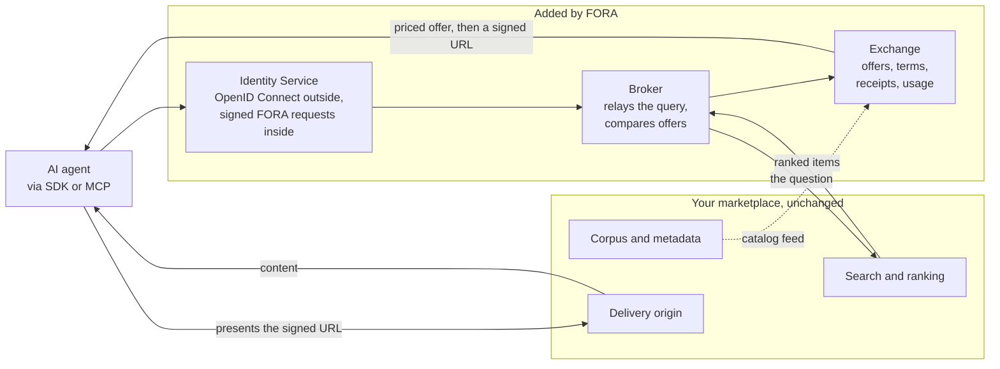

import { Aside } from '@astrojs/starlight/components';

A content marketplace built in-house has one front door. Each AI company that wants the content arrives through a conversation, a contract, an API key, and an integration written against that one API. The work does not compound: the tenth AI company costs roughly what the first one cost, and the ones that never make contact have no way to find the catalog at all.

FORA is an open transaction layer for metered resource access. A licensee that speaks the protocol can discover the catalog, read the price, accept the terms and pay per access, with no bilateral deal first.

Adopting it does not mean replacing what is already built. A marketplace and a FORA deployment need the same underlying pieces, and three of the four already exist in any working marketplace.

## The four components every marketplace has

**1. A corpus with per-item metadata.**
In FORA this is the catalog an Exchange lists. It is loaded from a feed the publisher emits and refreshed from the publishing pipeline. The content itself never moves.

**2. Search or ranking over that corpus.**
In FORA this is the query a Broker relays. The Broker passes an agent's question to the existing search endpoint and reads back the ranked results, so the existing ranking still decides what surfaces.

**3. A delivery origin.**
In FORA this is the delivery node. Often it is already the right shape: an origin returning Markdown or plain text, stripped of page chrome for machine readers, is what the protocol expects a delivery node to be.

**4. Access control and billing.**
This is the one FORA extends rather than replaces. Today it is an API key per customer and an invoice at month end. FORA adds verifiable identity, authorization per access, and a record of each access, while the existing key-based path keeps working underneath.

### What happens to the API key

The key does not go away, and a licensee does not have to abandon the credential scheme its organization already runs.

Inside FORA, every request is signed: RFC 9421 HTTP Message Signatures over Ed25519, with each party's public key published in a [WebBotAuth directory](/protocol/authentication/#the-wba-directory-endpoint). That is strong identity, and it is not what an enterprise licensee wants to implement from scratch.

So the reference implementation puts an [Identity Service](/components/identity/overview/) at the boundary and does the conversion there. Outside, a developer signs in with OpenID Connect, the same standard their company already uses for everything else. The reference deployment runs a stock Zitadel for this, with no custom plugins, so another OIDC provider drops into the same slot. Inside, the service holds each agent's signing key and publishes the public half where other parties can verify it. The licensee brings the credential it already has; FORA gets the signature it needs.

The effect is more ways in rather than a different way in. The catalog becomes reachable through the FORA SDKs and through MCP, which places it inside the agent tooling licensees already run, with no integration code on their side at all.

## How the pieces fit

1. An agent arrives through the SDK or through MCP. It signs in with the credential scheme it already has, and the Identity Service gives it a signing key FORA recognizes.
2. It asks a Broker for content. The Broker relays the question to the existing search and reads back the ranked items.
3. The Exchange turns those items into priced offers, drawing on a catalog loaded from the publisher's feed.
4. The licensee accepts an offer and receives a signed, expiring URL, good for that resource and often bound to that licensee.
5. The licensee presents the signed URL at the delivery origin, which verifies it and serves the content.

## What the transaction layer adds

**A priced offer before the fetch.** The licensee receives a signed quote for one resource, carrying the price, the terms and an expiry, and accepts or declines. Price attaches to the item rather than to the contract, so it can vary by resource, by licensee type, or by intended use.

**A record per access.** Each transaction produces a billing record and each delivery produces a usage report. Together they give who fetched what, when, under which offer, at which price, and how much was consumed after delivery. A monthly request count against an API key cannot produce that last figure.

**Logs that reconcile.** A single access leaves three independent records: the Exchange ledger, the delivery node's access log, and the licensee's usage report. They are expected to agree, and disagreement is the audit signal. A dispute then carries evidence rather than assertion. [Transaction Flow](/protocol/transaction-flow/) covers how the three line up.

**Licensing the request can be checked against.** A contract already states what a licensee may do: summarize but not train, display with attribution, no redistribution, a cap per month, not outside certain countries. Nothing checks that at the moment of access, because the contract is a document and the request is an HTTP GET. FORA carries those clauses on the resource as machine-readable terms, making the license a condition on the transaction.

<Aside type="note" title="Scope">
FORA authorizes, meters, signs and records. It does not move money. Settlement stays between the publisher and the Exchange operator, off-protocol, on whichever rail is already in use.
</Aside>

## Where the two systems meet

Two places in code, plus one data feed. Everything else on both sides keeps its current contract.

### Search

The existing search endpoint answers a question and returns ranked items. The Broker sends it a question and reads the ranked items back. Where search already takes a query string and returns identifiers or URLs, the relay is a mapping exercise rather than a rewrite.

The result ceiling is worth checking early. A search capped at five results per query caps the number of offers an agent can be shown for that query, whatever the protocol allows.

### Delivery

The origin currently serves callers holding an API key. FORA callers hold a signed URL. There are two ways to close that gap.

**Translation in front of the origin.** A service ahead of the origin verifies the signed URL and makes the upstream call with the key. The origin does not change. The cost is that this service holds a credential to the whole corpus and sees the content in the clear, which makes its operator a contractual question as well as a technical one.

**Verification at the origin.** The delivery node verifies the signed URL itself and the key is not involved. The protocol asks only that the retrieval URL verify before bytes are served. [Any surface that does that satisfies it](/components/edge-function/composition/#the-fora-edge-function-is-not-required-for-delivery): a CDN's native signed-URL check, a function at the edge, or the origin itself.

Either way the content, the formatting and the origin stay as they are.

### The catalog feed

FORA needs to know what the catalog contains. Marketplace APIs are usually question-driven, with no endpoint that enumerates everything, so there is normally nothing to crawl. The answer is a feed: a line per resource carrying the identifier, the metadata and the terms, loaded once and kept current from the publishing pipeline. [JSONL Ingestion](/protocol/jsonl-ingestion/) describes the format and the validation it passes before anything is signed.

## What stays with the publisher

- **The corpus and the ranking.** FORA never holds the bytes. Delivery is by instruction: the Exchange hands the licensee a signed URL pointing at the publisher's origin.
- **The price and the terms.** Per resource, per licensee type, per permitted use. The publisher sets them and the Exchange enforces what was set.
- **The Exchange seat.** Roles in FORA are compositional rather than exclusive, so a publisher can run its own Exchange over its own catalog and keep the transaction layer in-house. [Role Composition](/protocol/role-composition/) covers how the trust model holds when one operator wears several hats.
- **Existing deals.** Nothing here interferes with a bilateral contract, a bulk corpus arrangement or a direct API customer. FORA covers per-access licensing for agents at inference time; it is not a bulk delivery channel.

## What changes for the terms

Today the license lives in a signed agreement, enforced by trust and an annual audit. Under FORA the clauses move onto the resource itself, in a form the transaction is checked against.

- **Restrictions** limit who may license a resource and what they may do with it: by intended use, by licensee type, by country.
- **Obligations** survive the sale: carry the byline, keep the copyright notice, link back.
- **Quotas** cap volume: items per month, words, seats.

Unrecognized restriction values are carried through and reported as warnings. A pricing unit nobody recognizes is refused outright, because an access nobody can meter is an access nobody can bill. The vocabulary and its extension rules are in [Licensing Terms](/protocol/licensing-terms/) and [Extension Profiles](/protocol/extension-profiles/).

## Next steps

- [Live Demo: First License](/getting-started/poc-walkthrough/) — discover, transact and fetch, end to end, from a chat window
- [For Resource Providers](/getting-started/for-providers/) — deployment models by provider type
- [Role Composition](/protocol/role-composition/) — running an Exchange alongside a catalog
- [JSONL Ingestion](/protocol/jsonl-ingestion/) — the catalog feed format
