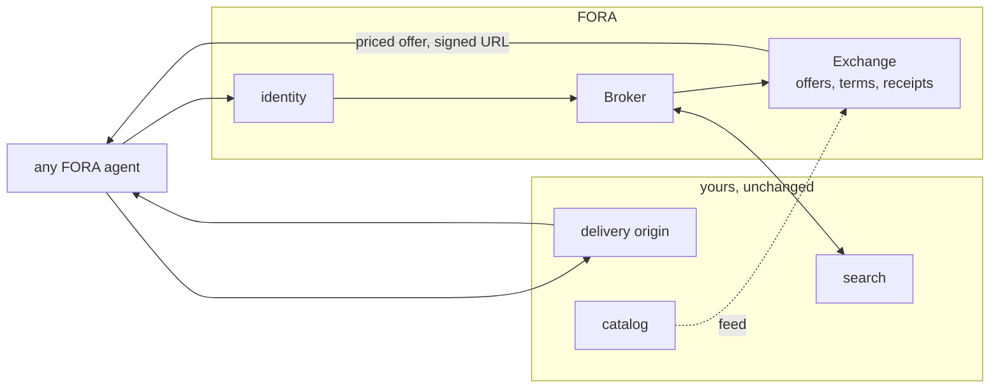

import { Aside } from '@astrojs/starlight/components';

## Where the months go

You built a content marketplace. Someone wants your content. They say yes.

Then the integration starts. Their engineers read your API docs, you answer questions, somebody writes a client, somebody else reviews the contract against what the client actually does, and months later the first byte is licensed. The next customer costs about the same. Nothing you learned in the first integration carries into the second, because the work was never yours — it was theirs, against your API.

That is the cost that does not go down, and it is the reason a signed deal and a working integration are months apart.

## What FORA changes

FORA is a protocol for licensing content per access. Agents that speak it already know how to discover a catalog, read a price, accept terms, and pay — because that part is the same everywhere.

Run it over your catalog and the integration stops being a project. A customer that already speaks FORA needs nothing built. The deal closes and the content is licensable the same week, because the only thing that was ever customer-specific was the plumbing, and the protocol is the plumbing.

Your marketplace keeps its own interface. FORA adds one that every agent already has a client for.

## How it fits over what you have

Your catalog, your ranking and your origin keep doing what they do. FORA adds the layer none of them has: a priced offer, a signed acceptance, and a record of the access.

## What you connect

Three things, and two of them are small.

| | What it does | What changes on your side |
|---|---|---|
| **Search** | An agent's question reaches your existing search; your ranking decides what surfaces | Map a query in, ranked results out |
| **Delivery** | Callers arrive with a signed, expiring URL instead of an API key | Verify the URL at your origin, or put a small service in front of it |
| **Catalog feed** | FORA needs to know what you have, and marketplace APIs rarely enumerate | Export a line per resource, then keep it current from your publishing pipeline |

The feed is data, not code. Nothing above changes a contract your existing customers depend on.

## What you get besides reach

Your marketplace sells access. It cannot easily say who read what, under which license, at what price — an API key and a monthly invoice do not carry that.

FORA makes each access a record: a priced offer before the fetch, a signed acceptance, a usage report after. License terms travel with the resource in a form the transaction is checked against, so "summarize but do not train" stops being a clause in a PDF and becomes a condition on the request.

<Aside type="note" title="What FORA does not do">
It authorizes, meters, signs and records. It does not move money, and it is not a bulk corpus channel — per-access licensing at inference time is the job. Settlement and your existing bulk deals stay exactly where they are.
</Aside>

## Next steps

- [Live Demo: First License](/getting-started/poc-walkthrough/) — the whole flow, end to end, in about five minutes
- [For Resource Providers](/getting-started/for-providers/) — deployment models by provider type
- [Role Composition](/protocol/role-composition/) — running the Exchange yourself, over your own catalog
- [JSONL Ingestion](/protocol/jsonl-ingestion/) — the catalog feed format
