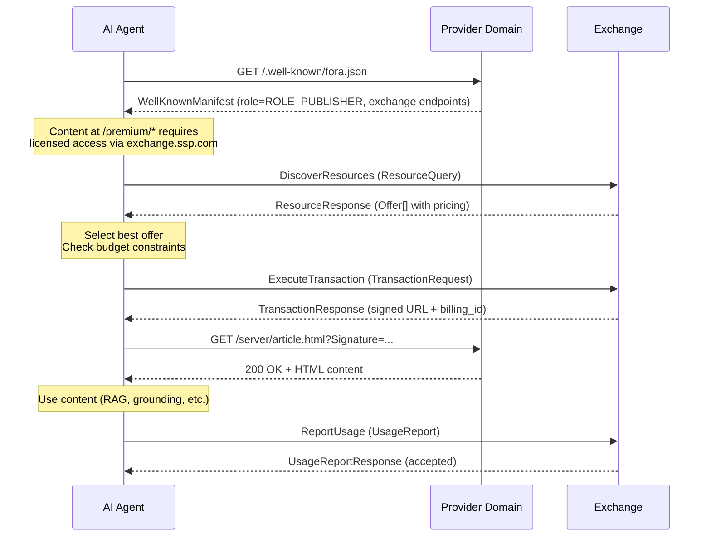
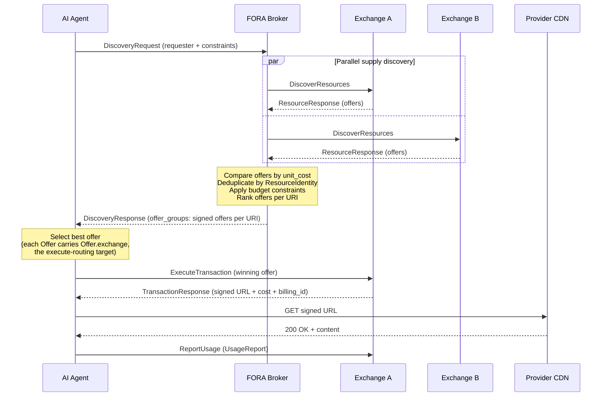
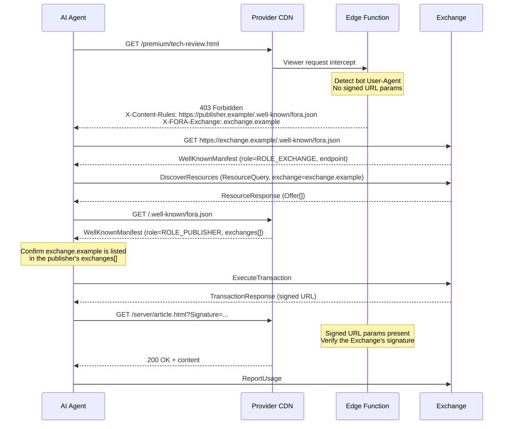
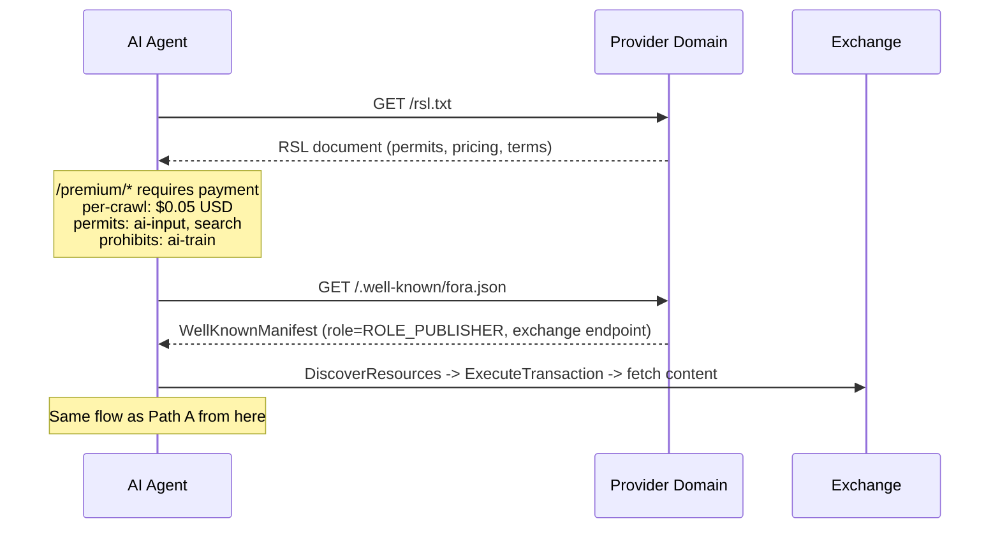
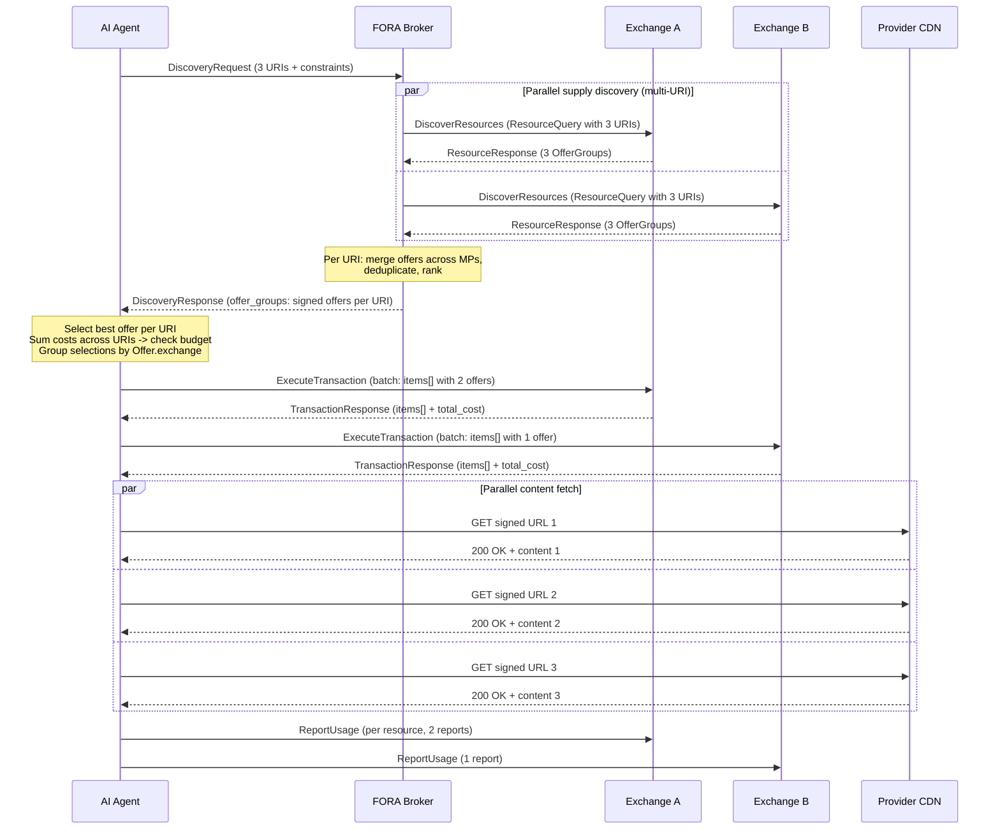
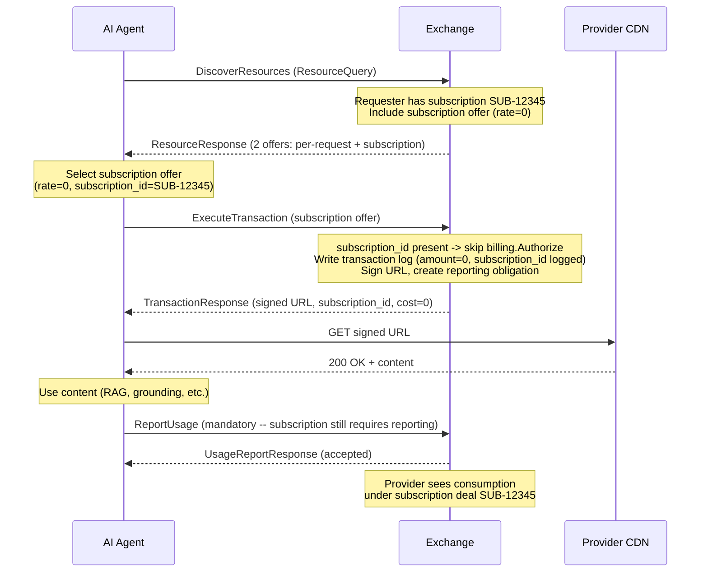

## Overview

An AI agent can enter the FORA flow through six paths. All paths converge on the same Exchange protocol -- the same `DiscoverResources`, `ExecuteTransaction`, and `ReportUsage` RPCs regardless of how discovery happened.

| Path | Entry Point | Use Case |
|---|---|---|
| [A: Proactive Discovery](#path-a-proactive-discovery-via-forajson) | `fora.json` | Agent checks before accessing content |
| [B: Broker-Mediated](#path-b-broker-mediated-multi-exchange) | Broker | Agent hands discovery to a multi-exchange router |
| [C: Accidental Discovery](#path-c-accidental-discovery-via-edge-function-403) | 403 response | Wandering bot hits protected content |
| [D: RSL-First](#path-d-agent-reads-rsl-directly) | `rsl.txt` | Agent reads terms, then finds Exchange |
| [E: Batch Multi-URL](#path-e-batch-multi-url-acquisition) | Broker | Agent needs multiple resources at once |
| [F: Subscription](#path-f-subscription-based-access) | Exchange | Agent has existing subscription deal |

## Path A: Proactive Discovery via fora.json

The preferred path. The agent checks `/.well-known/fora.json` before attempting to access content. No 403 needed, no wasted requests.



**Standards mapping:**

| Step | Message | Standard |
|---|---|---|
| Check fora.json | `WellKnownManifest` (role=ROLE_PUBLISHER) | **FORA** (exchange routing) |
| Discover supply | `ResourceQuery` / `ResourceResponse` | **FORA** wrapping **FORA Requester** |
| Offers returned | `Offer` with `Package` + `Pricing` | **FORA** Pricing + **CoMP** Package |
| Content attestations | `Offer.attestations` | **FORA** `ResourceAttestation` (replaces ResourceAttestation) |
| Access restrictions | `Offer.terms[0].restrictions` (`repeated Restriction`) | **FORA** mapping of **RSL** permits/prohibits |
| Execute transaction | `TransactionRequest` / `TransactionResponse` | **FORA** (billing_id, signed URL) |
| Fetch content | Signed URL on CDN | **FORA** extension (signed URL delivery) |
| Report usage | `UsageReport` | **FORA** (mandatory) |

## Path B: Broker-Mediated Multi-Exchange

The agent hands discovery to a FORA Broker, which chooses the Exchanges, queries multiple Exchanges in parallel, compares offers, and selects the best deal.



**Standards mapping:**

| Step | Message | Standard |
|---|---|---|
| Agent to Broker | `DiscoveryRequest` with `RequestConstraints` | **FORA** (budget, authorized exchanges) |
| Broker to Exchanges | `ResourceQuery` (parallel fanout) | **FORA** wrapping **FORA Requester** |
| Offer comparison | `Offer.pricing.unit_cost` | **FORA** unit cost normalization |
| Content dedup | `Offer.identity` (canonical_url, content_hash) | **FORA** ResourceIdentity extension |
| Content attestations | `Offer.attestations` | **FORA** v1.0 `ResourceAttestation` |
| Broker to Agent | `DiscoveryResponse` (offer_groups: signed offers per URI) | **FORA** -- discovery only, no delivery |
| Execute winning offer | `ExecuteTransaction` / `TransactionResponse` (signed URL + cost + billing_id) | **FORA** (separate execute step, routed via `Offer.exchange`) |
| Usage reporting | `UsageReport` to the winning Exchange | **FORA** |

## Path C: Accidental Discovery via Edge Function (403)

A wandering bot hits protected content without knowing about FORA. The edge function on the provider's CDN refuses it with `403` and two discovery headers: `X-Content-Rules` points at the provider's own manifest, and `X-FORA-Exchange` names an Exchange that sells this content directly.



The agent may fetch the publisher's manifest before, during or after discovery at the named Exchange. It must confirm the listing before it commits to an offer. Without `X-FORA-Exchange`, the agent reads the manifest first and continues as in Path A.

**Standards mapping:**

| Step | Standard |
|---|---|
| 403 + `X-Content-Rules` + `X-FORA-Exchange` | **FORA** edge discovery headers (not in CoMP or RSL) |
| `X-Content-Rules` value | Absolute URL of the provider's `/.well-known/fora.json` |
| `X-FORA-Exchange` value | Bare domain of an Exchange listed in that manifest, in the form of `Offer.exchange` |
| Exchange endpoint | Resolved from the Exchange's own `fora.json`, never from the header |
| All subsequent steps | Same as Path A |

The edge function is the "barking dog" -- a fallback for bots that did not check `fora.json` first.

### Edge discovery headers

The two headers are part of the protocol specification. The normative text is the "Edge discovery headers" section in the [`fora.proto`](https://github.com/FORA-Protocol/protocol/blob/main/proto/fora/v1/fora.proto) file header; this is a summary.

```http
HTTP/1.1 403 Forbidden
X-Content-Rules: https://publisher.example/.well-known/fora.json
X-FORA-Exchange: exchange.example
```

| | `X-Content-Rules` | `X-FORA-Exchange` |
|---|---|---|
| **Points at** | The publisher's manifest: the licensing terms, and in `exchanges[]` the Exchanges that sell this content | One Exchange that sells this content directly |
| **Value** | Exactly `https://` + the publisher's domain + `/.well-known/fora.json`. No userinfo, query, fragment, trailing slash or other path. The domain is the host the refused request was sent to, a port allowed. | The Exchange's bare domain, in the same form as `Offer.exchange`: a port allowed, no scheme or path. |
| **Edge sends it** | SHOULD, on every 403 to a request for licensed content that carries no valid signed URL | MAY, on the same 403, and only together with `X-Content-Rules`. It must name an Exchange the manifest lists. |
| **Role** | The authority | An optimisation over `X-Content-Rules`, never a replacement |

Each header appears at most once and carries one value. An agent reads them only from a `403` and ignores them on any other status. A value that is not of the shape above is ignored as if the header were absent, and the two headers are judged separately.

**How an agent uses them.** With `X-FORA-Exchange`, the agent can start discovery at the named Exchange without fetching the publisher's manifest first. It resolves that Exchange's endpoint from the Exchange's own `/.well-known/fora.json`, never from the header: the header says which Exchange to ask, not where to send the request. This is the same rule that applies to the `exchange` field of every addressed request. The domain is also the `exchange` the agent stamps on its `ResourceQuery`.

**Trust.** An agent MUST NOT treat `X-FORA-Exchange` as authorization. It is an unsigned value. The Exchange's offers are verified by their own Ed25519 signatures, as on every other path, and the publisher's manifest remains the authority on which Exchanges sell the content. When the header names an Exchange that the manifest does not list, the manifest wins: the agent discards the header, does not transact on an offer from that Exchange, and discovers at the Exchanges the manifest lists. The listing check uses the recipient identity match: exact domain, case folded, `:443` the same as no port, and a subdomain a different party.

The three SDKs read the headers with one parser each, pinned to a shared corpus:

| | Parse a 403 | Check the hinted Exchange against the manifest |
|---|---|---|
| Go | `helpers.ParseDiscoveryHint(status, header)` | `helpers.ReconcileDiscoveryHint(hint, listed)` |
| Python | `fora_sdk.parse_discovery_hint(status, headers)` | `fora_sdk.reconcile_discovery_hint(hint, listed)` |
| TypeScript | `parseDiscoveryHint(status, headers)` (export path `./discovery-hint`) | `reconcileDiscoveryHint(hint, listed)` |

`listed` is the `domain` of every entry in the publisher manifest's `exchanges`. The parser returns each header's value and a state, `absent`, `valid` or `malformed`; the check returns `listed`, `unlisted` or `no_exchange`. The header names are exported as constants: `ContentRulesHeader` and `ExchangeHeader` in all three languages.

## Path D: Agent Reads RSL Directly

An agent reads `rsl.txt` to understand terms, then uses `fora.json` to find the Exchange for transacting. RSL tells the agent *what it costs*; FORA tells it *where to pay*.



**Standards mapping:**

| Step | Standard |
|---|---|
| Read rsl.txt | **RSL 1.0** -- terms declaration |
| Read fora.json | **FORA** -- exchange routing |
| DiscoverResources | Exchange returns Offers with pricing derived from RSL |
| Offer.terms[0].restrictions | Maps RSL permits/prohibits to FORA `Restriction` (kind `RESTRICTION_KIND_FUNCTION`) on the offer's `LicenseTerm` |

## Path E: Batch Multi-URL Acquisition

The agent needs multiple resources in a single request (e.g., RAG grounding across several sources). The Broker sends all URIs in one `ResourceQuery` to each Exchange, receives `OfferGroups`, and returns the ranked signed offers per URI in a single `DiscoveryResponse`. Discovery stops there: the agent selects the best offer per URI and commits the selections itself via batch `ExecuteTransaction` calls (one per Exchange, routed by `Offer.exchange`), each returning a `TransactionResponse`.



**Standards mapping:**

| Step | Message | Standard |
|---|---|---|
| Agent sends multi-URI request | `DiscoveryRequest` with multiple URIs | **FORA** |
| Broker fans out | `ResourceQuery` with multiple URIs (one query per Exchange) | **FORA** wrapping **FORA Requester** |
| Exchange returns grouped offers | `ResourceResponse.offer_groups[]` with `OfferGroup` per URI | **FORA** OfferGroup extension |
| Broker returns offers to Agent | `DiscoveryResponse.offer_groups[]` (signed offers per URI) | **FORA** -- discovery only, no delivery |
| Empty OfferGroup diagnostic | `OfferGroup.absence_reason` (`OfferAbsenceReason` enum) | **FORA** v1.0 -- per-URI diagnostic when no offers available |
| Rate limit signaling | `ResourceResponse.rate_limit` (`RateLimitInfo`) | **FORA** v1.0 -- proactive throttling for Broker fanout |
| Batch transaction | `TransactionRequest.items[]` with `TransactionItem` per offer | **FORA** batch extension |
| Per-item results | `TransactionResponse.items[]` with `TransactionResultItem` per offer | **FORA** batch extension |
| Usage reporting | One `UsageReport` per resource (not per batch) | **FORA** |

### OfferAbsenceReason (v1.0)

When an `OfferGroup` has no offers, the `absence_reason` field explains why. This enables agents and Brokers to distinguish "content not in catalog" from "no offers matched your request" without trial-and-error transactions. The defined reasons:

::proto-enum{name=OfferAbsenceReason}

No reason reports that the requester's scopes do not cover a resource. Such a resource comes back with no offers and `absence_reason` unset, exactly like a resource with nothing to offer, so the requester never learns it exists (see [Existence hiding](/protocol/authentication/#existence-hiding)).

`RESTRICTION_FILTERED` reports an optional **convenience pre-filter** matched to the restriction attributes the requester volunteered (function / geography / user-type); the filtered axes are listed in `OfferGroup.restriction_filters` using the same `RestrictionKind` vocabulary the terms carry — not an enforcement verdict: restrictions ride on each offer's own term and the agent chooses among the offers (see [Licensing terms](/protocol/licensing-terms/)).

### RateLimitInfo (v1.0)

The `ResourceResponse` carries an optional `rate_limit` field with the caller's current rate limit status: `limit`, `remaining`, `reset_at`, and `window`. This is particularly important for Broker fanout -- when a Broker sends batch queries to multiple Exchanges, mid-batch rate limiting can cause partial results if not signaled early. Modeled after IETF RateLimit header fields.

### DiscoveryMethod (v1.0)

Each `OfferGroup` carries a `discovery_method` field indicating how the offers were sourced. The discovery methods:

::proto-enum{name=DiscoveryMethod numbers full}

This allows agents and Brokers to understand the provenance of each offer group and apply method-specific ranking or filtering logic.

Batch transactions are **non-atomic** -- individual items can fail independently. If one URI's offer fails authorization, the others proceed.

## Path F: Subscription-Based Access

The agent has an existing subscription deal with an Exchange. When querying supply, the Exchange includes subscription offers with zero marginal cost. The transaction skips per-request billing but still issues a signed URL and creates a usage reporting obligation.



**Key points:**

- **Subscription detection at query time**: The Exchange checks the requester's subscription status and includes offers with `subscription_id` and `rate=0`.
- **Reporting is still mandatory**: Subscription offers carry `ReportingObligation.required = true`. Providers need consumption data for subscription renewals and content strategy.
- **Quota enforcement**: The Exchange checks remaining quota before authorizing subscription transactions. If the subscription's token quota is exhausted, the subscription offer is not included.
- **Broker preference**: The Broker's selection engine ranks subscription offers above all per-request offers (zero marginal cost). When `preferred_exchanges` is set and the agent has subscriptions there, those offers get top priority.
- **Financial attribution**: The `subscription_unit_value` field carries the per-unit cost even though `cost.amount` is 0, enabling prepaid drawdown accounting.

## Next Steps

- [Transaction Flow](/protocol/transaction-flow/) -- detailed RPC definitions and wire formats
- [Authentication](/protocol/authentication/) -- Ed25519 signature chain across all paths
- [Scenario Walkthrough](/protocol/scenario-walkthrough/) -- a complete end-to-end scenario demonstrating multiple paths
