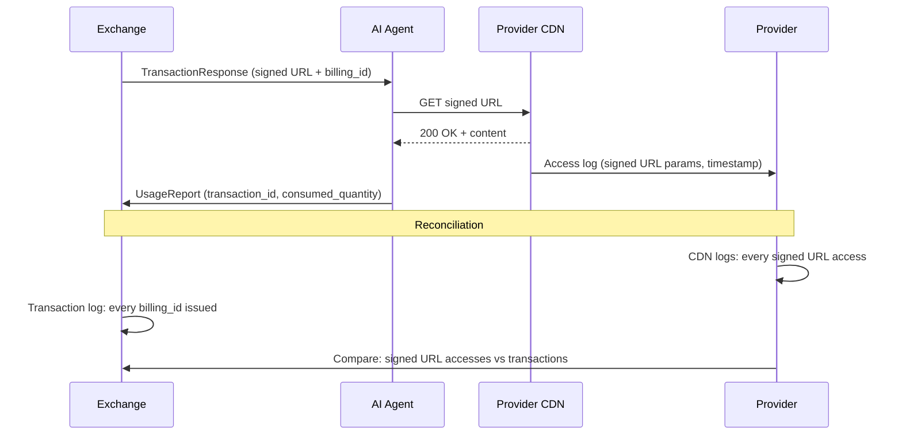

## The Exchange Protocol

The Exchange exposes four RPCs. This is the core protocol -- everything else is built on top of it. Both agents and Brokers are clients of the same Exchange interface. The Exchange does not know or care whether the request came from a Broker or directly from an agent.

```
With Broker (multi-exchange, budget control, reporting):
  Agent -> Broker -> Exchange A, B, C -> select best
  Agent -> Exchange A, B, C directly            -> buy, deliver
     or Agent -> Broker -> Exchange A, B, C     -> buy in one call, deliver

Without Broker (direct, single exchange):
  Agent -> Exchange -> deliver
```

After discovery the agent buys its selected offers one of two ways: directly, calling `ExchangeService.ExecuteTransaction` at each offer's `Offer.exchange`, or through the Broker, with one `BrokerService.ExecuteTransaction` call for offers from any number of Exchanges. See [Buying through a Broker](#buying-through-a-broker).

## Multi-Hop Routing

A request through a Broker reaches an Exchange in one of two ways, and they authenticate differently.

- **Re-packaged.** Both Broker RPCs terminate at the Broker. For `Resolve`, the Broker authors new per-Exchange `ResourceQuery` messages (the discovery fan-out). For `BrokerService.ExecuteTransaction`, it authors one `TransactionRequest` per Exchange. Each of these requests carries **only the Broker's** RFC 9421 signature, because the Broker wrote it. On a purchase, the agent's consent travels in the body as `AgentAcceptance` and `AgentRequestAcceptance`, which are detached signatures that stay valid however the request was re-packaged.
- **Forwarded byte-for-byte.** A request relayed unchanged keeps the agent's signature and gains one per forwarding hop. This is the forwarding chain described next. It applies to discovery forwarded toward an Exchange; a purchase through a Broker is always re-packaged.

A forwarded request typically travels `Agent -> Broker -> ... -> Exchange`, and the broker layer may itself be more than one hop. The forwarding chain lives entirely in the HTTP layer as a **stack of [RFC 9421](https://www.rfc-editor.org/rfc/rfc9421) HTTP Message Signatures** — there is no in-message hop list. Each party that originates or forwards the request adds **one** labeled signature (`Signature` / `Signature-Input`, e.g. `fora-agent`, `fora-broker-1`). Each forwarder's signature covers the request essentials (`@method`, `@authority`, `@path`, `Content-Digest`) **plus the previous hop's signature**, so the chain is ordered and tamper-evident: no hop can be reordered, dropped, or inserted without invalidating a downstream signature. The `keyid` on each signature is the key's RFC 7638 thumbprint. The request carries **one** covered `Signature-Agent` header — the agent's WBA directory at `{domain}/.well-known/http-message-signatures-directory`, forwarded unchanged by every relay — so the Exchange resolves the agent's key there, and takes each forwarding hop's key from the key set it is configured with (for example, Brokers registered with it). The Exchange verifies **every** signature and confirms the chain is contiguous. The ordered set of signatures *is* the forwarding chain.

**Chain-depth caps.** Two fields bound how deep a chain may go:

- `RequestConstraints.max_hops` -- the agent caps its own chain depth. A Broker MUST NOT forward a request whose signature count would exceed it.
- `WellKnownManifest.max_intermediary_hops` -- the Exchange publishes the longest inbound chain (signature count) it tolerates; longer chains SHOULD be rejected, and a Broker can prune before forwarding.

**Response path: direct.** Responses do **not** retrace the hop chain. The terminal Exchange returns its `ResourceResponse` directly to the originating agent; the Exchange-facing Broker that holds the agent binding relays it back without re-fanning through every hop. A purchase through a Broker is answered by the Broker, which combines the Exchanges' answers into one `BrokerTransactionResponse`. This works because the signed `retrieval_endpoint` is bound to the agent's identity (`agent_identity_hash`), so delivery needs no return-path relay. Intermediaries observe requests, not responses.

## RPC 1: DiscoverResources

The agent or Broker queries the Exchange to discover available content and pricing.

```
POST /fora.v1.ExchangeService/DiscoverResources
Content-Type: application/json
```

### Request (`ResourceQuery`)

{/* fora-validate: ResourceQuery */}
```json
{
  "ver": "1.0",
  "exchange": "exchange.ssp-example.com",
  "requester": {
    "id": "research-bot",
    "domain": "buyer.example.com",
    "type": "REQUESTER_TYPE_AGENT",
    "scopes": ["*"]
  },
  "uris": ["https://cdn.fora-protocol.org/premium/ai-infrastructure.html"],
  "acceptable_restrictions": [{ "axis": "RESTRICTION_KIND_FUNCTION", "values": ["ai-input"] }]
}
```

Key fields:
- `requester.domain` -- required; the host of the agent's key directory. On this direct request the Exchange fetches the Ed25519 public key from the WBA directory the covered `Signature-Agent` header names, `{directory}/.well-known/http-message-signatures-directory`, verifies the request's RFC 9421 HTTP Message Signature, and then requires `requester.domain` to name that same directory: a mismatch is refused as `unauthenticated` with `request_auth_failure` `SIGNATURE_INVALID` (see [Requester domain and the key directory](/protocol/authentication/#requester-domain-and-the-key-directory))
- `requester.id` -- required; a free label the agent chooses for attribution, such as which sub-agent or end customer is asking. It is never identity and never used to find keys
- `ResourceQuery.uris` -- the content URI(s) being requested
- `acceptable_restrictions` -- the restrictions the agent is willing to accept, grouped by axis; axis `FUNCTION` carries the intended use (RAG, training, search, etc.)
- `requester.scopes` -- entitlement scopes; `["*"]` means unrestricted public access
- billing carries no request field: the Exchange resolves the caller's account (the `billing_ref` minted at `ExchangeService.Register`) from the verified request signature, never from anything the caller sends
- request authentication -- an RFC 9421 HTTP Message Signature over the request (the agent's key is published in its WBA directory); when the request is forwarded, each hop adds its own labeled HTTP Message Signature, and the ordered stack of these header signatures is the forwarding chain (no in-message hop list)

### Response (`ResourceResponse`)

```json
{
  "ver": "1.0",
  "exchange": "exchange.ssp-example.com",
  "offers": [
    {
      "offer_id": "9d5735d7-1f17-4801-8dcf-7cac0b7b32b0",
      "exchange": "exchange.ssp-example.com",
      "title": "The Future of AI Infrastructure",
      "ext": {
        "comp.package_id": "PKG-TC-AI-INFRA",
        "comp.seller": "cdn.fora-protocol.org",
        "comp.citation_required": true,
        "comp.content_types": ["CONTENT_TYPE_TEXT"],
        "comp.retrieval_type": ["RETRIEVAL_TYPE_HTML"]
      },
      "pricing": {
        "model": "PRICING_MODEL_PER_UNIT",
        "rate": "0.00002",
        "currency": "USD",
        "unit_cost": "0.00002",
        "estimated_quantity": 2500,
        "unit": "tokens"
      },
      "delivery_method": "DELIVERY_METHOD_INSTRUCTIONS",
      "reporting": {
        "required": true,
        "window": "86400s",
        "required_fields": ["transaction_id", "function", "consumed_quantity"]
      },
      "identity": {
        "canonical_url": "https://cdn.fora-protocol.org/premium/ai-infrastructure.html",
        "iptc_guid": "urn:newsml:ap.org:20260310:ai-infra-001"
      },
      "terms": [
        {
          "semantics": "TERM_SEMANTICS_ENUMERATED",
          "restrictions": [
            {
              "kind": "RESTRICTION_KIND_FUNCTION",
              "permitted": ["ai-input", "ai-index", "search"],
              "prohibited": ["ai-train"]
            },
            {
              "kind": "RESTRICTION_KIND_USER_TYPE",
              "permitted": ["commercial", "education"]
            }
          ]
        }
      ],
      "previews": [
        {
          "url": "https://cdn.fora-protocol.org/preview/ai-infrastructure-snippet.txt",
          "media_type": "text/plain",
          "size": "sample"
        }
      ],
      "signature": "a1b2c3d4e5f6...",
      "signature_algorithm": "EdDSA"
    }
  ]
}
```

Each `Offer` includes:
- `Offer.title` (human-readable) plus optional `fora-comp-v1` `comp.*` ext fields carrying CoMP package metadata (`comp.package_id`, `comp.seller`, `comp.citation_required`, `comp.content_types`, `comp.retrieval_type`)
- FORA `Pricing` with the rate, currency, and normalized unit_cost; a metered (`PER_UNIT`) offer may also carry a positive `estimated_quantity` in its `unit`, which fixes the amount the agent accepts and the ceiling its usage report settles against. Without one there is no ceiling, and the report settles at the consumed quantity × rate (see [Settling a metered purchase](#settling-a-metered-purchase))
- `ResourceIdentity` for cross-exchange deduplication
- `LicenseTerm` entries on `terms[]`, each carrying `restrictions` (`repeated Restriction`) derived from the provider's RSL terms
- `ReportingObligation` defining post-usage reporting requirements
- `Preview` URLs for pre-transaction evaluation (see [Resource Previews](#resource-previews))
- An Ed25519 `exchange_signature` that proves the Exchange issued this offer

### Batch Multi-URL Query

When requesting multiple URIs, the response uses `offer_groups` instead of `offers`:

```json
{
  "ver": "1.0",
  "exchange": "exchange.ssp-example.com",
  "offer_groups": [
    {
      "uri": "https://cdn.fora-protocol.org/premium/ai-infrastructure.html",
      "offers": [
        {
          "offer_id": "9d5735d7-1f17-4801-8dcf-7cac0b7b32b0",
          "exchange": "exchange.ssp-example.com",
          "pricing": { "model": "PRICING_MODEL_PER_UNIT", "rate": "0.00002", "currency": "USD", "unit_cost": "0.00002", "estimated_quantity": 2500, "unit": "tokens" },
          "terms": [
            {
              "semantics": "TERM_SEMANTICS_ENUMERATED"
            }
          ],
          "signature": "a1b2c3...",
          "signature_algorithm": "EdDSA"
        }
      ]
    },
    {
      "uri": "https://cdn.fora-protocol.org/premium/gpu-shortage-2026.html",
      "offers": [
        {
          "offer_id": "89636cda-93f6-460e-af7f-2b6aef0f491b",
          "exchange": "exchange.ssp-example.com",
          "pricing": { "model": "PRICING_MODEL_PER_UNIT", "rate": "0.00002", "currency": "USD", "unit_cost": "0.00002", "estimated_quantity": 2500, "unit": "tokens" },
          "terms": [
            {
              "semantics": "TERM_SEMANTICS_ENUMERATED"
            }
          ],
          "signature": "d4e5f6...",
          "signature_algorithm": "EdDSA"
        }
      ]
    },
    {
      "uri": "https://cdn.fora-protocol.org/premium/openai-funding.html",
      "offers": []
    }
  ]
}
```

An empty `offers` array indicates the content is not available through this Exchange.

### Subscription Offers

When the requester has a subscription, the Exchange includes both per-request and subscription offers:

```json
{
  "offers": [
    {
      "offer_id": "9d5735d7-1f17-4801-8dcf-7cac0b7b32b0",
      "exchange": "exchange.ssp-example.com",
      "pricing": { "model": "PRICING_MODEL_PER_UNIT", "rate": "0.00002", "currency": "USD", "unit_cost": "0.00002", "estimated_quantity": 2500, "unit": "tokens" },
      "terms": [
        {
          "semantics": "TERM_SEMANTICS_ENUMERATED"
        }
      ],
      "signature": "a1b2c3...",
      "signature_algorithm": "EdDSA"
    },
    {
      "offer_id": "c5b01a4e-6536-4a42-a4fc-e41a1df1913d",
      "exchange": "exchange.ssp-example.com",
      "pricing": { "model": "PRICING_MODEL_FREE", "rate": "0", "currency": "USD", "unit_cost": "0" },
      "subscription_id": "SUB-12345",
      "terms": [ { "semantics": "TERM_SEMANTICS_ENUMERATED", "scopes": ["subscription:SUB-12345"] } ],
      "reporting": { "required": true, "window": "86400s", "required_fields": ["transaction_id", "function", "consumed_quantity"] },
      "signature": "g7h8i9...",
      "signature_algorithm": "EdDSA"
    }
  ]
}
```

### Subscription Quota Info

When the requester holds a subscription, the Exchange attaches `SubscriptionQuotaInfo` entries so the agent can see remaining allowance *before* committing. After the transaction, the updated quota appears on the response so the agent can track burn-down without a separate API call.

**Where it appears:**

- `Offer.subscription_quota` -- proactive signal at discovery time, letting the agent decide whether to commit or switch to a pay-per-request offer.
- `TransactionResponse.subscription_quota` -- post-transaction snapshot showing remaining quota after the decrement.

**Message fields:**

| Field | Type | Description |
|-------|------|-------------|
| `subscription_id` | string | Subscription this quota applies to |
| `quota_limit` | int32 | Total allowed in the current period |
| `quota_used` | int32 | Used so far in the current period |
| `quota_remaining` | int32 | Remaining in the current period |
| `resets_at` | Timestamp | When the quota counter resets (UTC) |
| `unit` | string | What is metered: `"accesses"`, `"tokens"`, `"spend_cents"`, `"burst"` |

**Multi-dimensional quotas.** A subscription may impose several independent limits -- for example, an access count *and* a spend cap. The `subscription_quota` field is `repeated`, so the Exchange returns one entry per dimension:

```json
{
  "offers": [
    {
      "offer_id": "c5b01a4e-6536-4a42-a4fc-e41a1df1913d",
      "exchange": "exchange.ssp-example.com",
      "pricing": { "model": "PRICING_MODEL_FREE", "rate": "0", "currency": "USD" },
      "subscription_id": "SUB-12345",
      "terms": [ { "semantics": "TERM_SEMANTICS_ENUMERATED", "scopes": ["subscription:SUB-12345"] } ],
      "subscription_quota": [
        {
          "subscription_id": "SUB-12345",
          "quota_limit": 5000,
          "quota_used": 1247,
          "quota_remaining": 3753,
          "resets_at": "2026-04-01T00:00:00Z",
          "unit": "accesses"
        },
        {
          "subscription_id": "SUB-12345",
          "quota_limit": 50000,
          "quota_used": 12300,
          "quota_remaining": 37700,
          "resets_at": "2026-04-01T00:00:00Z",
          "unit": "spend_cents"
        }
      ],
      "signature": "g7h8i9...",
      "signature_algorithm": "EdDSA"
    }
  ]
}
```

**Quota decrement timing.** The quota counter increments at `ExecuteTransaction` (optimistic -- the Exchange assumes the content will be consumed). If the agent later files a successful `DisputeTransaction`, the Exchange may reverse the decrement.

## RPC 2: ExecuteTransaction

The agent commits to a selected offer, receiving a signed URL for content delivery. A Broker calls this RPC too: once per Exchange, when it re-packages a purchase made through `BrokerService.ExecuteTransaction`.

```
POST /fora.v1.ExchangeService/ExecuteTransaction
Content-Type: application/json
```

### Request (`TransactionRequest`)

{/* fora-validate: TransactionRequest */}
```json
{
  "ver": "1.0",
  "idempotency_key": "tx-req-c7d1",
  "requester": {
    "id": "research-bot",
    "domain": "buyer.example.com",
    "type": "REQUESTER_TYPE_AGENT",
    "scopes": ["*"]
  },
  "items": [
    {
      "offer": {
        "offer_id": "9d5735d7-1f17-4801-8dcf-7cac0b7b32b0",
        "exchange": "exchange.ssp-example.com",
        "title": "The Future of AI Infrastructure",
        "pricing": {
          "model": "PRICING_MODEL_PER_UNIT",
          "rate": "0.00002",
          "currency": "USD",
          "unit_cost": "0.00002",
          "estimated_quantity": 2500,
          "unit": "tokens"
        },
        "delivery_method": "DELIVERY_METHOD_INSTRUCTIONS",
        "expires_at": "2026-03-14T02:30:00Z",
        "terms": [
          {
            "semantics": "TERM_SEMANTICS_ENUMERATED"
          }
        ],
        "signature": "a1b2c3d4e5f6...",
        "signature_algorithm": "EdDSA"
      }
    }
  ]
}
```

Each item's `offer` is the full signed Offer reflected back exactly as received at discovery; a single-offer transaction is the degenerate one-element `items` list. The Exchange verifies each item's `offer.signature` over the presented Offer bytes to confirm the offer has not been tampered with. The Exchange is stateless -- it verifies the self-contained signed Offer rather than storing offers.

The request may also carry `agent_request_acceptance` — the agent's detached Ed25519 signature over the complete ordered set of offers it committed to, across all Exchanges. The SDK clients attach it whenever the offer names its Exchange. It is what lets an Exchange receiving a Broker-projected subrequest prove the items are the exact in-order subset the agent signed — see [Projected execute requests](/protocol/authentication/#projected-execute-requests). The field is optional for wire compatibility: an older client that omits it keeps per-item execution semantics and simply gets no request-level claim.

### Response (`TransactionResponse`)

```json
{
  "ver": "1.0",
  "items": [
    {
      "transaction_id": "txn-mp-93a7f2",
      "billing_id": "bill-93a7f2-001",
      "resource_title": "The Future of AI Infrastructure",
      "retrieval_endpoint": "https://cdn.fora-protocol.org/server/premium/ai-infrastructure.html?Expires=1773451434&Key-Pair-Id=KXYZ&Signature=abc123...",
      "cost": {
        "amount": "0.05",
        "currency": "USD",
        "unit_cost": "0.00002"
      },
      "delivery_method": "DELIVERY_METHOD_INSTRUCTIONS",
      "reporting_obligation": {
        "required": true,
        "window": "86400s",
        "required_fields": ["transaction_id", "function", "consumed_quantity"]
      },
      "expires_at": "2026-03-14T02:30:00Z"
    }
  ],
  "agent_identity_hash": "NzbLsXh8..."
}
```

For a metered item whose offer states an estimate, `cost.amount` is the amount the agent accepted: the offer's `estimated_quantity` × `rate`, here 2,500 tokens × $0.00002 = $0.05. It is not the final charge; the usage report settles it. When the offer states no estimate, no amount is fixed at purchase, and the report settles the charge at the consumed quantity × rate (see [Settling a metered purchase](#settling-a-metered-purchase)).

The `retrieval_endpoint` is a CDN signed URL bound to `agent_identity_hash`. A bearer-only CDN serves it on signature + expiry alone (the URL signature + short TTL + TLS); a capable edge function additionally requires the agent to present its public key and an RFC 9421 signature, verifying the binding offline. See [Signed URL Verification](/components/edge-function/signed-url-verification).

### Denials are in the body

Every decision about an item is answered in the response body. An item the Exchange denies is a `TransactionResultItem` with `denial_reason` set, in a response that returns OK. This holds whatever the item count: a one-item purchase that is denied is a successful response whose only item is denied, and it is never turned into a non-OK error.

```json
{
  "ver": "1.0",
  "items": [
    {
      "offer_id": "9d5735d7-1f17-4801-8dcf-7cac0b7b32b0",
      "denial_reason": "DENIAL_REASON_RESTRICTION_NOT_SATISFIED",
      "restriction_mismatches": ["RESTRICTION_KIND_GEOGRAPHY"]
    }
  ]
}
```

A denied item was not purchased, so it carries no `retrieval_endpoint` and no charge. `restriction_mismatches` names the failed axes when the reason is `DENIAL_REASON_RESTRICTION_NOT_SATISFIED`.

A non-OK error carrying `ErrorDetail.transaction_denial` is used only when the Exchange refuses the **whole request** and decides no item. That happens for a reason about the caller that would deny every item alike: the caller has no account (`DENIAL_REASON_ACCOUNT_NOT_REGISTERED`), its account is not active (`DENIAL_REASON_ACCOUNT_INACTIVE`), it has overdue reports (`DENIAL_REASON_REPORTING_OVERDUE`), or it is rate limited (`DENIAL_REASON_RATE_LIMITED`). Nothing is purchased. Other errors keep their own classes: a malformed request is `invalid_argument`, and a request signature that does not verify is `unauthenticated`.

**Totals across currencies.** `total_cost` is the exact sum of the purchased items' costs in their one shared currency. When the purchased items span more than one currency, `total_cost` is unset: amounts are never summed across currencies, and currency conversion is out of scope for this version. Each item's own `cost` still carries its amount and currency.

### Idempotency

`idempotency_key` is scoped to the caller that authenticated the request: the agent on a request it signed, and the pair (Broker, requester) on a purchase the Broker re-packaged. A key that another agent used, or that was used at another tenant, is a different key and never a collision.

- The same key with the **same** request (the same items in the same order) is a replay. The Exchange answers it with the stored result and executes nothing again.
- The same key with a **different** request (different items, or the same items in another order) is refused with the Connect code `already_exists`, carrying an `ErrorDetail` with no typed reason. Nothing is executed, and the stored result is unchanged. A new purchase takes a new key.

The same rules apply to `UsageReport.idempotency_key` and `DisputeRequest.idempotency_key`.

### What Happens Inside the Exchange

1. Validate request (proto validation)
2. Verify the sender's RFC 9421 HTTP Message Signature (alg=ed25519) in the request headers — the agent's on a direct request, the Broker's on a sub-request the Broker re-packaged. On a direct request, also require `requester.domain` to name the directory the covered `Signature-Agent` header names. On a re-packaged sub-request the agent is authenticated by its body acceptances instead: each item's `AgentAcceptance` is verified against an Ed25519 key in the directory `requester.domain` names, an acceptance whose canonical bytes name an empty requester is refused, and a delegation's holder binding (`cnf.jkt`) is checked against the key the item's `AgentAcceptance` verifies under, not against the Broker
3. Verify `agent_request_acceptance` when present: the signature, and that this request's items are the complete in-order projection of the signed set addressed to this Exchange. A request whose items are not exactly that projection (an item dropped, added or reordered) has every item denied with `DENIAL_REASON_SIGNATURE_INVALID`, in the body: the agent's signature does not cover what arrived. It is not an `invalid_argument` error. This runs **before** the idempotency lookup — request-level idempotency state is never created or served for a request whose set claim has not been proven, otherwise a mutated request could consume the key and a later honest retry would replay its result
4. Check the idempotency key, scoped to the caller: a replay of the same request returns the stored result, and the same key with different items is refused with `already_exists` (see [Idempotency](#idempotency))
5. Verify each item's offer signature over the presented offer bytes; an item whose signature does not verify is denied with `DENIAL_REASON_SIGNATURE_INVALID`, in the body
6. Authorize billing (`BillingAdapter.Authorize`) -- or skip for subscription offers
7. Write transaction to WAL (must succeed before signing URL)
8. Generate the Ed25519 signed delivery URL (or a CloudFront RSA canned policy, per the tenant's signing scheme)
9. Create reporting obligation with deadline

### Batch TransactionRequest

For batch transactions, use the `items` array:

{/* fora-validate: TransactionRequest */}
```json
{
  "ver": "1.0",
  "idempotency_key": "tx-batch-01",
  "requester": {
    "id": "research-bot",
    "domain": "buyer.example.com",
    "type": "REQUESTER_TYPE_AGENT",
    "scopes": ["*"]
  },
  "items": [
    {
      "offer": {
        "offer_id": "9d5735d7-1f17-4801-8dcf-7cac0b7b32b0",
        "exchange": "exchange.ssp-example.com",
        "pricing": { "model": "PRICING_MODEL_PER_UNIT", "rate": "0.00002", "currency": "USD", "unit_cost": "0.00002", "estimated_quantity": 2500, "unit": "tokens" },
        "expires_at": "2026-03-14T02:30:00Z",
        "terms": [
          {
            "semantics": "TERM_SEMANTICS_ENUMERATED"
          }
        ],
        "signature": "a1b2c3...",
        "signature_algorithm": "EdDSA"
      }
    },
    {
      "offer": {
        "offer_id": "89636cda-93f6-460e-af7f-2b6aef0f491b",
        "exchange": "exchange.ssp-example.com",
        "pricing": { "model": "PRICING_MODEL_PER_UNIT", "rate": "0.00002", "currency": "USD", "unit_cost": "0.00002", "estimated_quantity": 2500, "unit": "tokens" },
        "expires_at": "2026-03-14T02:30:00Z",
        "terms": [
          {
            "semantics": "TERM_SEMANTICS_ENUMERATED"
          }
        ],
        "signature": "d4e5f6...",
        "signature_algorithm": "EdDSA"
      }
    }
  ]
}
```

### Batch TransactionResponse

```json
{
  "ver": "1.0",
  "items": [
    {
      "offer_id": "9d5735d7-1f17-4801-8dcf-7cac0b7b32b0",
      "transaction_id": "txn-mp-batch-001",
      "billing_id": "bill-batch-001",
      "retrieval_endpoint": "https://cdn.fora-protocol.org/server/premium/ai-infrastructure.html?Signature=...",
      "cost": { "amount": "0.05", "currency": "USD" },
      "expires_at": "2026-03-14T02:30:00Z"
    },
    {
      "offer_id": "89636cda-93f6-460e-af7f-2b6aef0f491b",
      "transaction_id": "txn-mp-batch-002",
      "billing_id": "bill-batch-002",
      "retrieval_endpoint": "https://cdn.fora-protocol.org/server/premium/gpu-shortage.html?Signature=...",
      "cost": { "amount": "0.05", "currency": "USD" },
      "expires_at": "2026-03-14T02:30:00Z"
    }
  ],
  "total_cost": { "amount": "0.10", "currency": "USD" },
  "agent_identity_hash": "NzbLsXh8..."
}
```

Each item gets its own `transaction_id`, `billing_id`, and signed URL. Batch transactions are non-atomic -- individual items can fail independently, and each denied item carries its `denial_reason` in the body. `total_cost` is set here because both items are priced in USD; it would be unset if they spanned two currencies.

### Buying through a Broker

`BrokerService.ExecuteTransaction` buys offers from any number of Exchanges in one call. The agent sends the same `TransactionRequest` it would send an Exchange — every item with its `AgentAcceptance`, plus one `AgentRequestAcceptance` over all items — signed for the Broker's URL.

```
POST /fora.v1.BrokerService/ExecuteTransaction
Content-Type: application/json
```

The Broker re-packages the purchase:

1. It verifies the agent's request signature, and checks that `requester.domain` is the agent's verified signing directory (the host of the WBA directory the covered `Signature-Agent` header names).
2. It groups the items by each signed offer's `exchange`. It checks that it can route to each Exchange and approves it for purchases before it sends anything.
3. It sends one `ExchangeService.ExecuteTransaction` per Exchange, signed with **its own** key. Each sub-request carries that Exchange's items in request order with their acceptances, the agent's `AgentRequestAcceptance` unchanged, the agent's `requester` and the agent's `idempotency_key` unchanged. Each Exchange verifies the agent's consent from the body, against the keys in the directory `requester.domain` names: the Broker's signature says only that the call comes from the Broker, and the acceptances are the only agent signatures the Exchange sees.
4. It combines the answers into one `BrokerTransactionResponse`.

Re-packaging and combining are safe because each item is atomic and its integrity is per resource. Each offer carries the signature of the Exchange that issued it, covering price, terms, expiry and `exchange`. Each acceptance binds the agent to that one offer, the requester and the idempotency key. Each item's result comes from the Exchange that owns the resource. The Broker therefore assembles independent per-resource purchases, and it cannot change what an item buys, from whom, at what price or for whom without breaking that offer's signature or the agent's acceptance. The `AgentRequestAcceptance` also stops it dropping, adding or reordering items within one Exchange's sub-request. No cross-item integrity is needed. On the response side, the one signed value in a result item is `retrieval_endpoint`, which the issuing Exchange signed. The other fields are the Broker's unsigned report of what each Exchange answered; the charge itself is still bounded by the signed offer the Exchange verified.

```json
{
  "ver": "1.0",
  "items": [
    {
      "offer_id": "6edb0ed0-6f7f-4fb2-877b-ea7fa271ad07",
      "transaction_id": "txn-a-001",
      "billing_id": "bill-a-001",
      "retrieval_endpoint": "https://cdn.publisher.example/a1?Signature=...",
      "cost": { "amount": "0.05", "currency": "USD" }
    },
    {
      "offer_id": "7a9482de-d0d2-4bfb-ba99-c2506dc2bc91",
      "refusal": {
        "exchange": "exchange-b.example",
        "code": "permission_denied",
        "detail": {
          "domain": "fora.v1.ExchangeService",
          "transaction_denial": {
            "reason": "DENIAL_REASON_ACCOUNT_NOT_REGISTERED",
            "exchange": "exchange-b.example"
          }
        }
      }
    },
    {
      "offer_id": "5c43dd75-9960-4ebf-bbbd-06d4f9014a40",
      "transaction_id": "txn-a-002",
      "billing_id": "bill-a-002",
      "retrieval_endpoint": "https://cdn.publisher.example/a2?Signature=...",
      "cost": { "amount": "0.40", "currency": "EUR" }
    }
  ],
  "exchanges": [
    { "exchange": "exchange-a.example", "offer_ids": ["6edb0ed0-6f7f-4fb2-877b-ea7fa271ad07", "5c43dd75-9960-4ebf-bbbd-06d4f9014a40"], "agent_identity_hash": "NzbLsXh8..." },
    { "exchange": "exchange-b.example", "offer_ids": ["7a9482de-d0d2-4bfb-ba99-c2506dc2bc91"] }
  ],
  "totals": [
    { "amount": "0.05", "currency": "USD" },
    { "amount": "0.40", "currency": "EUR" }
  ]
}
```

- `items` has one entry per request item, in request order. A success, or a per-item denial, is the Exchange's `TransactionResultItem` unchanged.
- **Upstream refusals ride in the body.** When an Exchange refuses the Broker's whole sub-request, or does not answer it, the Broker does not turn that into an error of its own. Each affected item carries `refusal`: the Exchange, the Connect `code` it answered with, and its `ErrorDetail` unchanged. The other Exchanges' results come back unchanged. `DENIAL_REASON_CONTENT_UNAVAILABLE` is not a catch-all for upstream failures.
- `exchanges` has one `ExchangeOutcome` per Exchange contacted. Its `agent_identity_hash` is what that Exchange's retrieval URLs are bound to.
- `totals` sums only the charged items (those with neither `denial_reason` nor `refusal`), one `Cost` per currency. Amounts are never summed across currencies.
- `DENIAL_REASON_RELAY_NOT_ACCEPTED` on an item means the provider that sells that item's resource at that Exchange does not accept purchases relayed by a Broker. It is decided per item, by each offer's provider, and answered in the body: other items of the same sub-request may succeed. It is never a refusal of the whole sub-request. Buy that offer directly.
- A sub-request whose items are not exactly the agent's signed `AgentRequestAcceptance` projected onto that Exchange has every item denied with `DENIAL_REASON_SIGNATURE_INVALID`, in the body, and nothing is purchased.

The Broker's own refusals are non-OK Connect errors carrying an `ErrorDetail`, and nothing was bought: an invalid agent signature is `unauthenticated` with `request_auth_failure`; a `requester.domain` that is not the agent's signing directory is `unauthenticated` with `request_auth_failure` `SIGNATURE_INVALID`; a malformed request is `invalid_argument`; an Exchange the Broker cannot route to or does not approve is `failed_precondition`, with `metadata["exchange"]` naming it.

A retry is safe. The Broker forwards the agent's `idempotency_key` unchanged to every Exchange, so each Exchange answers a repeated sub-request from its stored result. A timed-out sub-request is an ambiguous outcome, and retrying with the same key is how the agent resolves it.

### Subscription TransactionResponse

```json
{
  "ver": "1.0",
  "items": [
    {
      "transaction_id": "txn-sub-001",
      "billing_id": "bill-sub-001",
      "retrieval_endpoint": "https://cdn.fora-protocol.org/server/premium/ai-infrastructure.html?Signature=...",
      "cost": { "amount": "0", "currency": "USD" },
      "subscription_id": "SUB-12345",
      "subscription_unit_value": { "amount": "0.05", "currency": "USD", "unit_cost": "0.00002" },
      "reporting_obligation": { "required": true, "window": "86400s", "required_fields": ["transaction_id", "function", "consumed_quantity"] }
    }
  ],
  "agent_identity_hash": "NzbLsXh8..."
}
```

## RPC 3: ReportUsage

After content has been used, the agent submits a usage report. When `ReportingObligation.required` is set on the offer, reporting is mandatory -- failure to report within the window may trigger `DENIAL_REASON_REPORTING_OVERDUE` on subsequent transactions.

```
POST /fora.v1.ExchangeService/ReportUsage
Content-Type: application/json
```

### Request (`UsageReport`)

{/* fora-validate: UsageReport */}
```json
{
  "ver": "1.0",
  "exchange": "exchange.ssp-example.com",
  "idempotency_key": "ur-e4f2a1",
  "transaction_id": "txn-mp-93a7f2",
  "billing_id": "bill-93a7f2-001",
  "usage": {
    "function": ["ai-input"],
    "subfn": ["rag"],
    "consumed_quantity": 2400,
    "displayed_to_user": true,
    "citation_included": true
  },
  "timestamp": "2026-03-14T01:45:00Z",
  "assets": [{
    "uri": "https://cdn.fora-protocol.org/premium/ai-infrastructure.html",
    "title": "The Future of AI Infrastructure",
    "package_id": "PKG-TC-AI-INFRA"
  }]
}
```

### Response (`UsageReportResponse`)

```json
{
  "ver": "1.0",
  "report_id": "rpt-e4f2a1-001"
}
```

A successful response carries the Exchange-assigned `report_id` (the handle the agent later references in `DisputeRequest`). It carries no amounts, also when part of a metered report is held for dispute: the settlement is a pure function of the signed offer and the reported quantity, so the agent computes it itself (see [Settling a metered purchase](#settling-a-metered-purchase)). A rejected report is not a success body -- it travels as a non-OK transport error carrying `ErrorDetail.usage_report_rejection` (e.g. `USAGE_REPORT_REJECTION_REASON_WINDOW_EXPIRED`, `USAGE_REPORT_REJECTION_REASON_MISSING_REQUIRED_FIELDS`).

### What the Exchange Validates

1. The report is well formed. A malformed report is refused with `USAGE_REPORT_REJECTION_REASON_MALFORMED` and the Connect code `invalid_argument`
2. Required fields present (as defined by `ReportingObligation.required_fields`)
3. Report received within the reporting window (typically 24 hours). A report that arrives after the window closed is refused with `USAGE_REPORT_REJECTION_REASON_WINDOW_EXPIRED` and the Connect code `failed_precondition`: the typed reason names the time cause
4. Transaction exists and `billing_id` matches

**The reported quantity is unrestricted.** A consumed quantity that differs from the offer's estimate is **not** a validation failure, above or below, and no check on the quantity refuses a report. For a metered offer the Exchange settles the report as described below; a quantity far from the estimate is analysed out of band, never by refusing the report.

### Settling a metered purchase

A `PER_UNIT` price is metered: it is charged per unit consumed, and the quantity is known only after use. Up to three values on the offer's own `pricing` fix what such a purchase can cost, and the offer signature covers them, so accepting the offer is consenting to them:

| Symbol | Field | Meaning |
|---|---|---|
| R | `rate` | The price of one `unit` |
| E | `estimated_quantity` | The estimate, in `unit`. **Optional.** A `PER_UNIT` offer may state a rate with or without an estimate; whether to state one is the publisher's decision. An estimate that is stated is positive (`offer.metered.estimate_positive`), and the SDK verifiers reject a zero one |
| T | `estimate_tolerance_bps` | The tolerance on the estimate, in basis points: `1000` (10%) when the term states none, `0` for none, at most `10000`. It applies only when the offer states an estimate |

**Without an estimate there is no ceiling.** The agent accepts the rate R. When the usage report arrives, its `consumed_quantity` C is charged **C × R**, whatever C is, and nothing is held. Nothing in such an offer bounds what the purchase is charged.

**With an estimate the purchase settles within a tolerance.** At purchase the agent accepts **E × R**, the `cost` of the item. When the usage report arrives, its `consumed_quantity` C settles against the ceiling **Q = E × (10000 + T) / 10000**:

| Consumed quantity | Charged | Held for dispute |
|---|---|---|
| C ≤ E (below the estimate) | C × R | nothing |
| E < C ≤ Q (within the tolerance) | C × R | nothing |
| C > Q (above the ceiling) | Q × R | (C − Q) × R |

The quantity above the ceiling is held, never charged automatically: nothing above Q × R is charged unless dispute resolution establishes that it is owed. Q × R is therefore the most an estimated metered purchase costs without a dispute, and the amount an agent budgets against a spend cap. Q can be fractional, and every step is exact decimal arithmetic: the inputs are integers and decimal strings, and the only division is by 10000.

With the offer above (E = 2,500 tokens, R = $0.00002, no stated tolerance, so Q = 2,750):

| Reported | Charged | Held |
|---|---|---|
| 2,400 tokens (the report above) | $0.048 | — |
| 2,700 tokens | $0.054 | — |
| 3,000 tokens | $0.055 | 250 tokens, $0.005 |

The response to a report that holds an excess is still a plain success with a `report_id`; the `transaction_id` and that `report_id` identify the held excess. This version defines no `DisputeReason` for it and no filing by the publisher's side, so how a claim to the excess is raised is left open; what the protocol fixes is that it is never charged automatically. A metered price with `metering: PRICING_METERING_NONE` has no report, so E × R is final when it states an estimate. This version does not say what such a price charges when it states none.

The SDKs compute all of this exactly: `MeteredSettlementCap` / `metered_settlement_cap` / `meteredSettlementCap` returns Q × R, or reports that there is no cap when the price states no estimate, and `SettleMeteredUsage` / `settle_metered_usage` / `settleMeteredUsage` returns the accepted, ceiling, charged and held amounts (without an estimate, no accepted amount and no ceiling). The shared metered-settlement vectors pin every language to the same digits.

## Content Delivery (Outside Protocol Scope)

The FORA protocol covers discovery, negotiation, and transaction execution. Content delivery is outside protocol scope -- it is handled by the Exchange implementation and the provider's CDN.

The `TransactionResponse` carries two relevant fields:

- `DeliveryMethod` -- a hint indicating whether the Exchange is providing content directly or providing retrieval instructions
- `retrieval_endpoint` -- the signed URL the agent uses to fetch content

How the agent actually retrieves content (signed URLs, access tokens, inline content) depends on the Exchange and CDN implementation, not the protocol.

### Streaming Delivery

FORA supports `DELIVERY_METHOD_STREAMING` for real-time resource access (WebSocket, SSE, HLS, Icecast). The signed URL points to a streaming endpoint. Stream mechanics (heartbeat, reconnection, concurrent connection limits) are managed by the provider, not the FORA protocol.

**Session lifecycle:**

1. `ExecuteTransaction` returns a signed URL with expiry (e.g., 2 hours)
2. Agent connects to the stream endpoint
3. Agent receives data continuously
4. URL expires -- agent re-requests through the same FORA flow
5. `ReportUsage`: `consumed_quantity` in minutes/hours, `consumed_unit` matching the offer's unit

Streaming applies to live broadcasts, quote feeds, monitoring feeds, and any resource where content is delivered continuously rather than as a single fetch.

### Resource Mutability

`ResourceIdentity.resource_mutability` signals whether a resource's content is stable across time:

| Value | Meaning | Hash Behavior |
|---|---|---|
| `RESOURCE_MUTABILITY_STATIC` | Content does not change (articles, papers, legislation) | Agent SHOULD verify `content_hash`. Mismatch is disputable. |
| `RESOURCE_MUTABILITY_DYNAMIC` | Content updates between offer and fetch (credit reports, drug databases) | Agent MUST NOT auto-dispute hash mismatch. Use `data_as_of` for freshness. |
| `RESOURCE_MUTABILITY_LIVE` | No content exists at offer time (streams, broadcasts) | No `content_hash` applicable. Metering is time-based. |

The Exchange MUST set `resource_mutability` on every `ResourceIdentity`. For `DYNAMIC` resources, the Exchange MUST set `data_as_of` on the Offer. For `LIVE` resources, the Exchange MUST NOT set `content_hash`.

## Reconciliation via Signed URLs



Three independent records -- CDN logs, Exchange transactions, usage reports -- that must agree. This provides stronger reconciliation than ad-tech's two-sided model.

## Consistency Model

FORA uses **at-most-once with reconciliation**, same as OpenRTB:

- Idempotency keys on every `TransactionRequest`, scoped per caller (prevent double-charge on retry; a key reused with different items is refused with `already_exists`)
- "Authorize first, deliver second" ordering (do not issue signed URL until billing succeeds)
- Reconciliation via `UsageReport` -- if content was not actually used, the report says so
- Credits and refunds come from dispute resolution (`DisputeTransaction`, below), which every Exchange implements; the protocol standardizes the dispute signal, not the settlement between the parties

## RPC 4: DisputeTransaction

When delivered content does not match what was promised, the agent files a dispute. The agent MUST file a `UsageReport` before disputing -- `DisputeRequest.report_id` is required.

```
POST /fora.v1.ExchangeService/DisputeTransaction
Content-Type: application/json
```

### Request (`DisputeRequest`)

{/* fora-validate: DisputeRequest */}
```json
{
  "ver": "1.0",
  "exchange": "exchange.ssp-example.com",
  "idempotency_key": "dsp-20260318-abc123",
  "transaction_id": "txn-mp-93a7f2",
  "billing_id": "bill-93a7f2-001",
  "reason": "DISPUTE_REASON_CONTENT_MISMATCH",
  "description": "Content hash does not match attested hash",
  "received_content_hash": "sha256:e5f6a7b8...",
  "received_hash_method": "sha256",
  "report_id": "rpt-20260318-xyz789"
}
```

### Response (`DisputeResponse`)

```json
{
  "ver": "1.0",
  "dispute_id": "case-20260318-def456",
  "estimated_resolution": "1s",
  "status": "DISPUTE_STATUS_AUTO_RESOLVED",
  "resolution": "RESOLUTION_TYPE_CREDIT"
}
```

Every Exchange implements `DisputeTransaction`; it is part of the core protocol, not an optional capability. A successful response means the dispute was accepted for processing (`dispute_id` + `status` + `resolution`). A refusal to file is not a success body -- it travels as a non-OK transport error carrying `ErrorDetail.dispute_failure`, whose `DisputeFailureReason` names the one check the filing failed:

| Reason | The filing failed because |
|---|---|
| `DISPUTE_FAILURE_REASON_TRANSACTION_NOT_FOUND` | `transaction_id` names no transaction this Exchange executed for the caller |
| `DISPUTE_FAILURE_REASON_REPORT_NOT_FILED` | No accepted usage report precedes it: `report_id` is empty, unknown, or names a report for another transaction |
| `DISPUTE_FAILURE_REASON_WINDOW_EXPIRED` | The transaction's dispute window, set by the Exchange, has closed |
| `DISPUTE_FAILURE_REASON_DUPLICATE` | A dispute was already filed for this transaction. A retry of the same filing under the same `idempotency_key` is a replay and returns the original `DisputeResponse` |
| `DISPUTE_FAILURE_REASON_INELIGIBLE` | The transaction's state admits no dispute under the Exchange's rules |

A dispute that is accepted and later found unsupported ends as `RESOLUTION_TYPE_REJECTED`; it is not a refusal to file. The Exchange resolves most accepted disputes automatically in under 1 second using CDN logs and cryptographic evidence. See [Dispute Resolution](/protocol/dispute-resolution/) for the three-tier resolution system, auto-credit rules, and the complete dispute lifecycle.

## Resource Previews

Offers may include lightweight preview URLs for pre-transaction evaluation. The Exchange holds only the URL (50–200 bytes); the provider's CDN serves the actual bytes. Agents fetch previews only when evaluating offers -- not on every discovery query.

```proto
message Preview {
  string url = 1;            // CDN-hosted preview URL
  string media_type = 2;     // MIME type ("image/jpeg", "audio/mpeg", "text/plain")
  optional int32 width = 3;  // Pixels (images/video)
  optional int32 height = 4;
  optional int32 duration = 5; // Seconds (audio/video clips)
  optional string size = 6;  // "thumbnail", "preview", "sample"
}
```

### Per Content Type

| Content Type | Preview | What the URL Points To |
|---|---|---|
| **Image** | Watermarked thumbnail | Small JPEG, 150–450px, provider-watermarked |
| **Video** | Short clip | 10–30 second MP4/WebM, watermarked |
| **Audio** | Short clip | 15–30 second MP3, low-bitrate or watermarked |
| **Text** | Snippet or abstract | First 200 words or abstract as text/plain |
| **Data / records** | Sample record | 1–3 sample rows as application/json |
| **Stream** | Optional frame capture | Or none -- streams are priced by time, not by content |

### Example: Image Offer with Previews

```json
{
  "offer_id": "9bb01145-326e-42a9-b2ac-058e3114bdfc",
  "exchange": "exchange.ssp-example.com",
  "title": "Climate Summit Photo - Reuters",
  "pricing": { "model": "PRICING_MODEL_PER_UNIT", "rate": "0.50", "currency": "USD", "estimated_quantity": 1, "unit": "accesses" },
  "previews": [
    {
      "url": "https://cdn.reuters.com/preview/150/climate-summit.jpg",
      "media_type": "image/jpeg",
      "width": 150, "height": 100,
      "size": "thumbnail"
    },
    {
      "url": "https://cdn.reuters.com/preview/450/climate-summit.jpg?sig=abc&exp=300",
      "media_type": "image/jpeg",
      "width": 450, "height": 300,
      "size": "preview"
    }
  ]
}
```

### Design Rationale

This follows the universal content exchange pattern:

- **Shutterstock**: `small_thumb.url` (100px, unwatermarked), `preview.url` (450px, watermarked), `preview_1500.url` (1500px, watermarked)
- **Spotify**: `preview_url` -- URL to a 30-second MP3 clip
- **IIIF**: Parameterized URL template -- client requests any size
- **OpenRTB**: `img.url` + `img.w` + `img.h` per asset

Nobody puts image bytes in offer metadata. The Exchange holds a URL string; the CDN holds the pixels.

## Next Steps

- [Authentication](/protocol/authentication/) -- Ed25519 signature chain details
- [Content Attestation](/protocol/content-attestation/) -- cryptographic content verification
- [Dispute Resolution](/protocol/dispute-resolution/) -- three-tier dispute resolution system
- [Scenario Walkthrough](/protocol/scenario-walkthrough/) -- complete end-to-end scenario with all phases
- [Discovery Paths](/protocol/discovery-paths/) -- all entry points into the protocol
